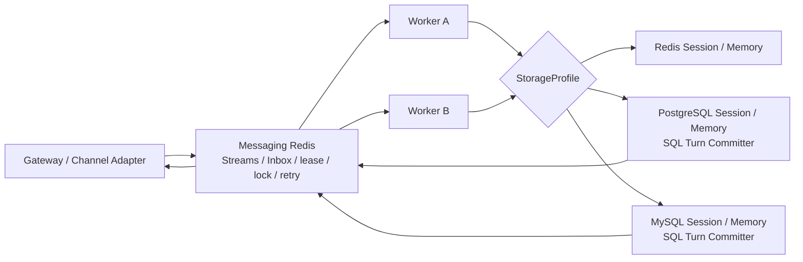
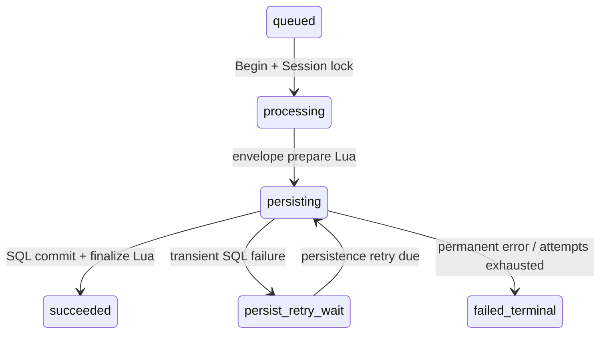

# Phase 5.5 Redis / PostgreSQL / MySQL 多后端持久化

> 实现日期：2026-09-04
> tRPC-Agent-Go 根模块：`v1.11.2`

## 结论与边界

Phase 5.5 在 Redis Streams、task lease 和 Strong Session fencing 不变的前提下，增加租户级 PostgreSQL/MySQL Session 与 Memory。Redis 始终负责协调；SQL 只保存被选中租户的 Session/Memory：

```text
Redis tenant      -> Redis coordination + Redis Session/Memory
PostgreSQL tenant -> Redis coordination + PostgreSQL Session/Memory
MySQL tenant      -> Redis coordination + MySQL Session/Memory
```

SQL Turn 必须提交成功，Worker 才能在 Redis 中写成功结果和 Reply。SQL 故障不会回退 Redis、不会换后端，也不会重新调用模型。Redis 租户继续使用原 `CompleteTurn` Lua，不进入 SQL `persisting` 状态机。

本阶段只保证同一个已经暂存的 Session Turn 不会重复提交 SQL，不保证模型、Tool、Memory、IM 或其他外部副作用 exactly-once。Knowledge、向量库、Artifact 和对象存储不在本阶段。

## 运行结构



Worker 在 Agent 执行期间仍同时维持 task heartbeat 与 Session heartbeat。SQL 成功后才 finalize Redis；转入持久化重试时释放当前 lease/lock，但保留不可变信封和 Session 顺序位置。

## 配置契约

三租户示例见 [`configs/phase5.5.example.json`](../configs/phase5.5.example.json)。JSON 仍为严格 `schema_version=1`，Task wire schema 不变。

SQL StorageProfile 字段：

| 字段 | 规则 |
| --- | --- |
| `credential_ref` | 必须是 `env:` 引用；JSON 不保存 DSN |
| `table_prefix` | Profile 独占；只允许 ASCII SQL identifier 字符，平台规范化为 `_` 结尾 |
| `schema` | 仅 PostgreSQL；默认 `public`；schema 必须预先存在 |
| `skip_db_init` | `false` 创建并验证，`true` 只验证现有表和幂等关键索引 |

固定的旧模块把 prefix（PostgreSQL 还包括 schema）嵌入索引名。为避免 PostgreSQL/MySQL 静默截断索引名后官方 verifier 误判，平台在连接前限制：

- PostgreSQL：`len(schema) + len(normalized_table_prefix) <= 27`；
- MySQL：规范化后的 `table_prefix` 最多 29 bytes。

MySQL DSN 必须显式指定数据库，并显式包含 `parseTime=true&charset=utf8mb4&loc=UTC`。驱动在缺少 `loc` 时也会默认 UTC，因此平台校验原始 query，而不是只检查解析后的默认值。

Messaging 新增默认值：

| 字段 | 默认值 |
| --- | --- |
| `persistence_timeout` | `10s` |
| `persistence_max_attempts` | `5` |
| `persistence_initial_backoff` | `1s` |
| `persistence_max_backoff` | `30s` |
| `persistence_payload_max_bytes` | `4 MiB`，且不得小于 `max_turn_bytes` |

## 后端指纹

Messaging Redis 以 `tenant_id + agent_app_id` 保存不可变指纹：backend kind、StorageProfile ID、去凭据后的数据库身份、schema/table prefix 或 Redis logical DB/key prefix，以及指纹版本。

用户名、密码、TLS 参数和连接池设置不进入指纹，所以凭据轮换不会迁移数据。backend kind、数据库、schema、table prefix 或 Redis namespace 改变会产生 `backend_fingerprint_conflict`，只拒绝目标 Tenant/Agent。升级后的现有 Redis Agent 在第一次正式执行时建立初始指纹。

SQL Backend 的 `String`/`GoString` 不输出 DSN、用户、密码、主机或数据库名；配置错误和连接错误统一映射为稳定分类，不透传驱动错误。指纹只保存已脱敏身份，不保存凭据。

## Session staging 与 Redis 状态机

`sessionfence.StagingSession` 是后端无关的 Turn staging 接口。Redis 与 SQL 都在进程内暂存 Create/Event/State；SQL wrapper 的历史读取委托官方 SQL Session Service，但当前 Turn 在 Committer 事务前不会写 SQL。

SQL 路径状态：



`processing`、`persisting`、`persist_retry_wait` 均无 TTL。只有成功或终态失败设置 Inbox retention；终态删除原 Task payload、完整持久化信封、owner/lease 和重试字段，只保留结果摘要、错误码、attempt 与哈希。

信封 `schema_version=1`，绑定原始 payload digest、租户/Agent/Profile、backend fingerprint、Session coord/seq、TurnCommit、最终 Reply、prepared time 和 envelope digest。`persist_attempt` 不进入不可变 digest，重试始终重放同一 Turn。

每个 Lua 在第一次写操作前验证所有 key 类型及业务条件。损坏或缺失信封不会留在无 TTL 中间态：Worker 取得与原始 Task/Session 坐标绑定的 fenced lease 后，用独立终态 Lua 写 `persistence_envelope_invalid`、推进 Session 游标、发送安全失败结果并清除信封。

崩溃恢复：

| 崩溃点 | 恢复行为 |
| --- | --- |
| 写信封前 | 维持原至少一次 Agent 执行语义 |
| 写信封后、SQL 前 | 新 Worker 直接重放信封，不调用 Agent |
| SQL commit 后、Redis finalize 前 | Committer 通过 task receipt 识别已提交，只补 finalize/Reply |
| Redis finalize 后 | Inbox 终态与 Reply 已原子完成，不再写 SQL |

## SQL 表和事务契约

官方表使用 Profile 的 `table_prefix`。平台增加：

```text
<prefix>platform_session_heads
<prefix>platform_turn_commits
```

`platform_session_heads` 记录 Session 当前 SQL 序号和 backend fingerprint digest。`platform_turn_commits` 以 `task_id` 为主键，并唯一约束 `(session_coord, session_seq)`，保存 payload/envelope digest 与提交时间。

Committer 直接使用官方 `storage/postgres.Client.Transaction` 或 `storage/mysql.Client.Transaction`，事务顺序固定：

1. 创建并 `FOR UPDATE` 锁定 Session head；
2. 按 `task_id` 查询 receipt；全坐标/摘要一致即幂等成功，不一致即完整性错误；
3. 校验 `session_seq == last_committed_seq + 1`；
4. 创建或更新官方 `session_states`，更新时保留 `created_at`；
5. 按 Turn 顺序写 `session_events`，SQL 行时间为 `prepared_at + Nµs`，JSON 保留 Event 原时间；
6. 插入 receipt 并推进 head；
7. 提交事务；任一步失败全部回滚。

`Ready` 探测全部官方 Session/Memory 表和平台表的列，并验证关键 JSON/sequence 类型与 MySQL `TIMESTAMP(6)` 精度；同时验证 Session active-state、Memory 主键、head 主键、task receipt 主键和 Session sequence 唯一约束。MySQL 还要求全部相关表为 InnoDB 和 utf8mb4。该契约绑定下列精确模块版本，任何升级都必须重跑 schema、官方 Service 可读性和真实数据库测试。

## PostgreSQL 与 MySQL 差异

| 项目 | PostgreSQL | MySQL |
| --- | --- | --- |
| Session | `session/postgres v1.11.0` | `session/mysql v1.11.2` |
| Memory/Storage | `memory/postgres`、`storage/postgres v1.11.0` | `memory/mysql`、`storage/mysql v1.11.0` |
| 并发 | Session head `FOR UPDATE` | Session head `FOR UPDATE`，不依赖 nullable `deleted_at` unique 行为 |
| 时间 | UTC connection/container | UTC + `TIMESTAMP(6)`，Event 行时间微秒单调 |
| Summary | 强制禁用 | 委托官方同步 Service |
| 异步 Session persistence | 关闭 | 关闭 |

SQL Memory 固定 `memoryLimit=0`、Extractor=nil，并关闭 Add/Update/Delete/Clear/Search/Load 六种 Memory Tool。旧 SQL Memory 的有限容量路径是“先计数再写入”，不能作为并发强配额，本阶段禁止配置官方 limit。

PostgreSQL Summary guard 会清除 Get/List 的 Summary，`GetSessionSummaryText` 返回未找到，Create/Enqueue 返回 `postgres_summary_disabled` 且不落库。所有连接使用 UTC 只是运行约束，不视为缺陷修复。

## Readiness、错误与故障隔离

`/healthz` 只表示进程存活。全局 `/readyz` 检查 Messaging Redis、Worker loop 和必要 Channel；不会初始化或检查所有 SQL Profile。SQL 只在目标租户被选中时惰性 Ready，因此一个 SQL 租户不可用或指纹冲突不会拉低其他租户或整个 Worker 的 readiness。Redis 协调不可用时所有租户 fail closed。

稳定错误码包括：

```text
backend_fingerprint_conflict
sql_unavailable
sql_schema_incompatible
sql_commit_digest_conflict
sql_session_sequence_conflict
persistence_retry_exhausted
persistence_envelope_invalid
postgres_summary_disabled
```

SQL unavailable 进入独立持久化重试，不增加 Agent attempt；schema、摘要、序号、指纹和信封完整性冲突直接终态失败。成功 SQL commit 前不会发送成功 Reply。

## 已合并上游修复与当前规避

三个上游修复已合并，但本阶段不追逐未包含于正式 tag 的代码：

| 问题 | 已合并修复提交 | 当前固定版本与规避 |
| --- | --- | --- |
| PostgreSQL Summary 跨时区 freshness | `7adbd288` | `session/postgres v1.11.0`；Summary guard 全禁用 |
| MySQL async persistence 日志 `%w` 导致 vet 失败 | `75cb280e` | `session/mysql v1.11.2`；关闭 async persistence；项目自身 `go vet ./...` 正常运行 |
| Redis Memory limit 非原子 | `83a84371` | `memory/redis v1.11.0`；所有 Memory 后端都使用无限容量 |

出现包含修复的正式 tag 后，只升级对应独立模块。升级前必须通过：官方表 schema contract、Asia/Shanghai Summary 回归、真实 PostgreSQL/MySQL、SQL commit 后崩溃恢复、Redis Strong/Legacy 和完整 Channel 回归。只有 PostgreSQL 非 UTC 回归通过后才可删除 Summary guard；只有 MySQL 模块自身 vet 正常后才可重新评估 async persistence；Memory limit 即使修复也仍需平台容量策略评审。

## 验收入口

真实 SQL Smoke 通过环境变量显式启用，未提供 DSN 时自动 skip：

```bash
PHASE55_POSTGRES_DSN='postgres://...'
PHASE55_MYSQL_DSN='user:...@tcp(...)/db?parseTime=true&charset=utf8mb4&loc=UTC'
go test -count=1 -v ./trpcservice/storage -run 'Test(Postgres16|MySQL8)SQLBackendSmoke'
```

Smoke 覆盖两轮 Turn、重复 task 幂等、官方 Session Event/State 读取、`created_at` 保留、Memory CRUD/Clear/Search、跨 Backend 实例可见、工具关闭、`skip_db_init` 验证、缺表 fail closed 与失败构造资源清理。Redis 状态机和 Worker 测试覆盖 persistence retry、无提前回复、Agent 不重跑、SQL receipt 幂等恢复、损坏信封终态化与 Lua wrong-type 无部分副作用。
