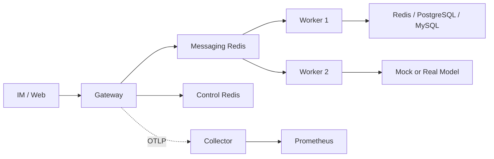
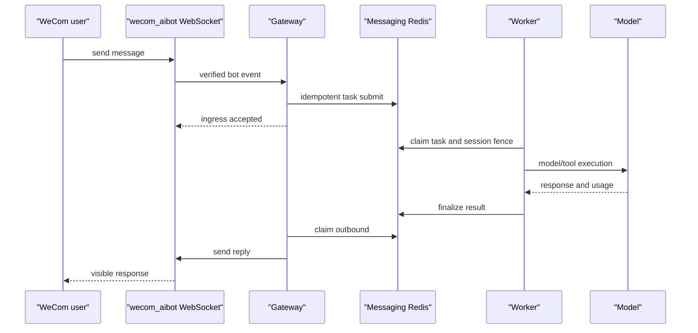
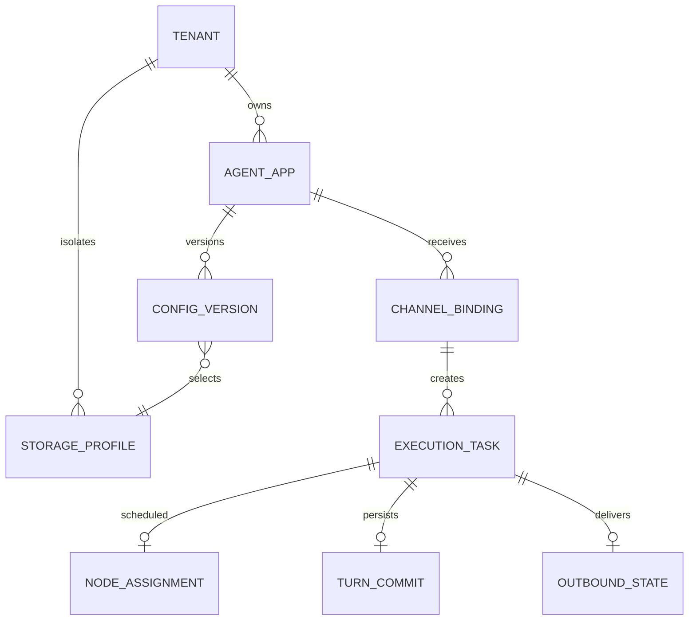

# Phase 7 Final Design

Phase 7 packages the multi-tenant service as a reproducible Compose closure.
Full mode runs one Gateway, two Workers, separate control and messaging Redis,
PostgreSQL 16, MySQL 8, and offline Mock Model/Telegram services. Light mode
keeps a single Redis tenant for fast development. HA and obs are explicit
overlays: HA adds a standby Gateway, while obs adds a locked Collector and
Prometheus reachable only on loopback.

The request path is asynchronous and idempotent on channel, binding and
platform message ID. Strong session fencing keeps the session lock, turn
commit and task lease in a compatible topology. A worker crash leaves the task
for stale-lease recovery; the next attempt rechecks the payload fingerprint and
never commits a canceled first turn. SQL initialization calls the framework
Session/Memory constructors and the existing platform commit validator, so the
service has one schema authority.

Telemetry uses a bounded OTLP HTTP batch (queue 2048, batch 512, one-second
schedule and two-second export timeout) and W3C TraceContext. Collector failure
is fail-open for business traffic and readiness. The Redis metric sink stores
discrete, tenant-scoped events; OTel instruments provide aggregate time series.
IDs are span attributes only, never metric labels. Model and tool callbacks
record duration, token usage and stable status without request content or
credentials.

Admin is Bearer-protected. Reconciler, task and outbound views are read-only and
return only operational fields. The web UI and Admin audit page are safe to
capture as evidence after redaction. Real WeCom uses only `bot_id_ref` and
`bot_secret_ref`; Telegram remains Mock-only for acceptance. Missing account,
network or credential conditions produce `skipped_with_reason` and do not block
the release.

Vector/object storage, Kubernetes, production observability, backup and
disaster recovery are documented designs. A migration uses a shadow profile,
digest/count verification and reversible routing. Production rollback starts by
freezing writes, fencing the old workers, restoring the prior profile and
replaying durable tasks. Risks include model quota exhaustion, Redis split brain,
SQL schema drift, duplicate IM delivery, outbound provider throttling, stale
leases, secret leakage, high-cardinality metrics and cross-region clock skew.

## 部署边界与运行模式

Phase 7 的目标是提供一个可重复启动、可自动验收、失败原因明确的交付单元。默认 full 模式包含一个 Gateway、两个 Worker、独立的 Messaging Redis 与 Control Redis、PostgreSQL 16、MySQL 8、Mock Model 和 Mock Telegram。Gateway 只负责接入、鉴权、路由、任务写入和出站发送，Worker 负责执行。Messaging Redis 承担可靠队列、租约、幂等、Session fencing 和恢复状态；Control Redis 承担策略、审计、指标事件、节点和 Assignment。Redis 租户与 Messaging Redis 使用相同 URL 和 DB，但有独立的租户 key prefix，以满足 strong fencing 的原子性要求。四个命名卷分别保存消息、控制、PostgreSQL 和 MySQL 数据，普通 down 不删除卷。

light 模式只启动一个 Redis 租户、一个 Gateway、一个 Worker 和 Mock Model，用于快速开发反馈，不能替代 full 验收。ha 叠加只在 F3 使用，增加 `gateway-standby`，并使用独立 consumer 和 `NODE_ID`。obs 叠加启动锁版本 Collector 与 Prometheus，宿主端口只绑定 `127.0.0.1`。两个 Mock 的控制接口只在 Compose 网络内开放，不映射到宿主或局域网。

## 请求、幂等与接管

每条入站消息先解析可信 ChannelBinding，再把 tenant、Agent App、固定配置版本和存储 Profile 固化进不可变任务。Inbox ID 由 tenant、binding 和平台 message ID 计算，同一平台消息重复到达时只能命中同一 Inbox。payload digest 覆盖影响执行语义的字段；相同 ID 但正文或目标不同会返回冲突，而不是复用旧结果。Gateway 只在任务持久写入后返回 accepted。

Worker 领取任务后同时获得任务租约和 Session 锁，执行期间分别续租；只有持有当前 lease epoch 与 lock token 的执行者能提交。两个 Worker 可以并行处理不同 Session，同一 Session 按 sequence 串行。Worker 在模型调用中崩溃时，旧租约到期后由另一 Worker 恢复，attempt 从 1 增加到 2。被取消的第一次执行不得提交 Session 或 SQL turn。关机沿用现有语义：节点进入 draining 并停止领取新任务，在途执行写入 `worker_shutdown` 重试，随后由同伴或重启后的 Worker 恢复。

## SQL 初始化、恢复与隔离

`sql-init` 不维护第二份 DDL。它加载与 Worker 相同的 Catalog 和 credential resolver，逐个构造现有 SQLBackend，由官方 Session/Memory 模块和 `sqlTurnCommitter` 完成建表与校验。平台已有 `platform_session_heads`、`platform_turn_commits` 仍由唯一 committer 维护。`sql-ready` 强制 `SkipDBInit=true`，只验证官方表、平台表、列、索引、存储引擎和字符集；指定类型不存在时返回非零，防止错误配置被当成成功。

SQL Backend 已初始化后若健康检查失败，会关闭 Session、Memory、健康连接和提交连接，并清空 initialized 状态。下一次 Ready 可在同一进程重建资源。因此 PostgreSQL 或 MySQL 恢复后不需要重启 Worker。故障只影响选择该 Profile 的租户，Redis 租户和另一 SQL 后端继续工作。后端指纹、SQL Turn 顺序、幂等键和表结构均不改变。

## 可观测性设计

平台自建 OTel SDK Provider，使用 OTLP HTTP exporter。Span 队列 2048、最大 batch 512、调度间隔 1 秒、导出超时 2 秒、指标周期 5 秒，Compose 采样率为 1。配置格式和 endpoint 非法属于启动错误；Collector 暂时不可达属于运行期观测故障，不能改变业务结果或 `/readyz`。关闭时先停止 HTTP 接入，再关闭 Gateway/Worker、Runtime/Backend、Metric/Audit sink 和 Control Repository，最后有界关闭 Provider。

HTTP 或 IM 入站创建 `channel.ingress`，Gateway 当前 span 生成合法 W3C `traceparent`。当 digest-v2 与节点分配共同开启时，该字段进入任务摘要并跨 Redis 传播；Worker Extract 后创建 `worker.claim`，Runner、Session、Memory、Persistence 和 Outbound 都成为同一 Trace ID 的后代。关闭 digest-v2 时保持 Phase 5.5 字节兼容。tRPC-Agent-Go 原生 Model/Tool span 是底层调用权威，平台只增加业务边界和聚合指标，避免重复记录。

Redis MetricSink 保存可按租户查询的离散请求事件，Admin `/metrics` 查询的不是 Prometheus 时序数据。OTel instruments 保存 request、latency、model token、tool、IM outbound、storage error、persistence、assignment、heartbeat、degraded、telemetry drop 聚合及进程内在途任务 Gauge。每个进程使用显式环境值或 hostname 作为 `service.instance.id`，防止 Gateway 与两个 Worker 的 Gauge 序列碰撞。允许标签仅包括 tenant、Agent App、channel、backend、node、tool、error、status、operation、token type 和 reason；request、task、session、message ID 永不作为指标标签。Span 也不记录正文、密钥、DSN 或原始 Redis key。

## 企业微信时序

真实企业微信只引用 `PHASE7_WECOM_BOT_ID` 和 `PHASE7_WECOM_BOT_SECRET`。默认 full 禁用真实 WeCom，避免无账号时影响离线闭环。缺少凭据、网络或账号时记录 `skipped_with_reason`。Telegram 仅连接 Mock，不要求真实账号。

## 数据模型与多后端

Redis、PostgreSQL 和 MySQL 是已实现后端。Qdrant/Milvus 只作为 Knowledge/Embedding 设计，S3/MinIO 只作为 Artifact/文件设计，不增加模块、镜像或运行代码。向量 collection 与对象 bucket/key 必须包含租户作用域，credential 只保存引用。迁移采用影子 Profile：复制后校验记录数、内容 digest、抽样读取和权限边界；灰度只切选定租户或 Agent App，并比较成功率、延迟、token、存储错误和 outbound 重试。回滚只切回旧 Profile，新 Profile 在保留期后清理。跨区域切换前必须 fence 旧区域，再恢复数据并重放 durable inbox。

## 容量算例、发布与回滚

假设峰值 20 个任务每秒，模型 P95 为 4 秒，单 Worker 安全并发 16，则模型等待约需 `20 * 4 = 80` 个槽，至少 5 个 Worker；加入 30% 的重试、工具和存储余量后取 7 个。若每任务 10 个事件、每事件 2 KiB，写入约 400 KiB/s，保留 24 小时约 33 GiB，尚未计 Redis 编码、AOF 和副本。若每任务 15 个 span、每 span 1 KiB，观测写入约 300 KiB/s；Collector 队列只能吸收短抖动，不能代替容量规划。

发布时先部署兼容读取的新版本，运行 `sql-ready`，再小比例切 Gateway 流量与 Worker 容量。观察稳定后逐步放量。回滚时停止新版本领任务，让 lease 结束或过期，再恢复旧镜像。由于旧字节协议和 SQL schema 未破坏，回滚不需要数据逆迁移。配置、镜像 tag 和 credential reference 一起版本化，真实 Secret 永不进入 Git。

## 风险与控制

1. 模型配额或延迟突增：用有界 timeout、attempt 和 Mock 故障验证控制积压。
2. Messaging Redis 故障：AOF 与命名卷保证恢复，停机期间新请求明确 `not_ready`。
3. Control Redis 故障：调度 fail-closed，Admin 返回 `control_plane_unavailable`，恢复后重新 Ready。
4. SQL schema 漂移：`sql-ready` 只校验不修改，发现不兼容时隔离目标租户。
5. 重复 IM 与出站重试：Inbox 幂等和 Outbound 状态机分别防止重复执行与重复补发。
6. Worker 或区域双写：lease epoch、Session lock token 和区域 fencing 阻止过期提交。
7. 密钥或正文泄漏：只接受 env reference，Admin 与 telemetry 使用字段白名单，截图前脱敏。
8. 指标高基数：ID 禁止作为 label，Prometheus 只抓聚合指标。
9. Collector 反压：有界队列与短导出超时保持 fail-open，并记录 drop。
10. IM 供应商限流：Outbound 有界退避，Mock stats 验证恢复后只补发一次。
11. 时钟漂移：生产节点统一 NTP，租约判断依赖服务端时间。
12. 误删数据卷：普通 down 保留卷，仅显式 `clean.ps1 -Volumes` 清理。
