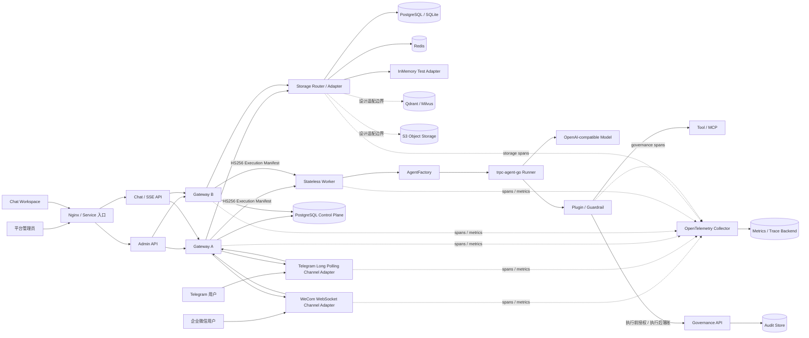

# 系统架构图

本文独立展示多租户节点化 Agent 平台的组件关系。设计原则、边界和执行语义见[架构设计文档](architecture.md)。

## 组件拓扑

## 图例与关系说明

| 类型 | 图中组件 | 责任 |
| --- | --- | --- |
| 外部入口 | Nginx / Service、Admin API、Chat / SSE API | 负载均衡、管理请求与流式对话准入 |
| IM 接入 | WeCom、Telegram Channel Adapter | 协议解析、账号与主体映射、入站去重和回复投递 |
| 编排 | Gateway A/B | Tenant 身份、治理预检、Lease、版本路由、事件持久化 |
| 执行 | Stateless Worker、AgentFactory、Runner | 按不可变版本构造 Agent，执行模型和 Tool |
| 治理 | Plugin / Guardrail、Governance API | allowlist、预算、敏感信息、确认、审计 |
| 数据 | Storage Router、SQL、Redis、向量库、S3 | 按 Tenant 选后端，分别承载事实、热数据、派生索引与大对象 |
| 观测 | OpenTelemetry Collector、Metrics / Trace Backend | 汇聚跨组件 trace 与 metrics；Audit Store 保存不可替代事实 |

实线表示在线请求或权威读写，虚线表示观测流或尚未落地的设计适配边界。Gateway 可以水平扩展，Worker 不持有租户和会话权威状态；同一 Session 的跨 Gateway 串行性由 PostgreSQL Lease 与 fencing token 保证，而不是依赖 sticky session。

当前 Stage 7 Compose 实际运行 Nginx、两个 Gateway、一个 Worker、PostgreSQL 和 Redis。Qdrant/Milvus、S3 与独立 OpenTelemetry Collector 在图中用于说明生产扩展接口，不代表比赛代码已包含生产适配器。
