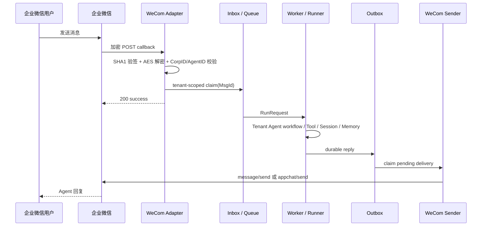

# 企业微信 Channel Adapter

## 交付边界

`trpcservice/channels/wecom` 实现企业微信自建应用的双向协议边界：

- `GET /channels/wecom/{binding_id}` 完成回调 URL 验证；
- `POST /channels/wecom/{binding_id}` 校验消息签名、AES-CBC 解密、校验 CorpID / AgentID；
- 文本、图片、文件、语音识别、位置和链接消息转换为统一 `gateway.InboundMessage`；
- `MsgId` 进入共享 Inbox 唯一键，企业微信重复投递不会重复运行 Agent；无 `MsgId`
  的事件使用 `FromUserName + CreateTime + Event + EventKey` 生成稳定 ID；
- `Sender` 使用 `message/send` 或 `appchat/send` 投递 Outbox 文本，支持 access token
  缓存和失效刷新、2048 字节 UTF-8 安全分片，以及限流 / 暂时错误分类。

Adapter 不直接调用 Runner。企业微信要求回调在 5 秒内返回，收到消息后只完成
`验签 -> 解密 -> Inbox claim -> queue submit`，立即返回 `200 success`；Worker 和
tRPC-Agent-Go Runner 在回调请求之外异步运行。



## 配置

```yaml
channels:
  - binding_id: support-wecom
    type: wecom
    provider_account_id: ww1234567890       # CorpID
    provider_app_id: "1000002"              # AgentID
    webhook_url: https://agent.example.com/channels/wecom/support-wecom
    token:                                   # 回调 Token
      provider: vault
      key: demo/assistant/wecom-callback-token
    secret:                                  # 自建应用 Secret，仅主动发消息取 token 使用
      provider: vault
      key: demo/assistant/wecom-app-secret
    encryption_key:                          # 43 字符 EncodingAESKey
      provider: vault
      key: demo/assistant/wecom-encoding-aes-key
    enabled: true
```

`Token`、`EncodingAESKey`、应用 Secret 和 access token 的实际值不进入配置快照正文、日志、
trace 或错误信息。env/file SecretRef 仅供离线开发和测试；持久化生产组合器只接受符合
tenant/app namespace 的 Vault KV v2-compatible 或 KMS-compatible SecretRef。

## 身份与会话

- `binding_id` 是租户内标识；不同租户同名时 Adapter 读取全部候选，以各自 Token、
  EncodingAESKey、CorpID/AgentID 验证并要求唯一匹配。无法消歧时返回 401，不按数据库行序选租户；
- 单聊：`user_id = wecom/{binding_id}/{FromUserName}`，
  `session_id = dm/{binding_id}/{FromUserName}`；
- 带 `ChatId` / `RoomId` 的群聊：
  `session_id = group/{binding_id}/{chat_id}`；
- binding 可配置 `allowed_users` 和 `allowed_chats`。ACL 使用验签解密后的
  `FromUserName` 与 `ChatId`/`RoomId`，在 Worker 创建 Runner 前判断；名单为空保持兼容，
  仅配置群白名单时直聊默认拒绝；
- `tenant_id`、`app_id`、`binding_id` 和固定 `config_version` 来自服务端绑定，不能由
  XML 消息正文覆盖；
- Outbox 同时保存 canonical user/session 和外部 user/chat ID，Sender 不需要反向猜测
  canonical ID。

权限拒绝只返回受控分类，不回显外部用户 ID、群 ID 或名单内容；同名 ID 在不同租户使用各自
配置版本独立判断。

## 消息与失败语义

- 文本直接进入 Agent；图片和文件在验签与租户匹配后仅通过固定企业微信 API 受控下载，
  并校验大小、MIME 和超时。无识别结果的语音仍使用安全占位文本。
- 不属于 Agent 输入的企业微信事件返回 `200 success`，避免 poison event 重试；签名、
  CorpID 或 AgentID 不匹配返回 `401`。
- Inbox / queue 暂时不可用返回 `503`，让企业微信按平台策略重试；重复 `MsgId` 返回
  `200 success`，但不会再次执行。
- `Sender` 将 `-1`、`45009`、HTTP 429 / 5xx 标为可重试；`40014`、`42001` 会先使
  access token 失效并刷新一次。生产 Delivery Worker 根据该分类执行带稳定 jitter 的
  指数退避和 DLQ。
- 企业微信对同一成员有平台频率限制，且文本最长 2048 字节。Adapter 负责分片，生产
  Sender 在每个分片发送前使用 Redis 对 `tenant_id + binding_id` 做跨节点限流。
- Outbox 使用 `pending -> claimed -> sending -> sent` 两阶段投递。`claimed` 节点崩溃后
  可以安全抢回；一旦进入 `sending`，节点失联或 HTTP 结果不确定时转为 `uncertain`，
  禁止自动重发。长消息已经成功发送部分分片后再失败，也进入 `uncertain`，避免用户
  收到重复片段。确定的暂时错误进入 `retry`，永久错误或重试耗尽进入 `dlq`。

## 测试

无需真实企业微信账号即可运行固定协议向量：

```bash
go test ./trpcservice/channels/wecom
```

覆盖 URL 验证、签名失败、AES 解密、CorpID / AgentID 隔离、重复消息幂等、UTF-8
分片、token 刷新、单聊 / 群聊端点和限流错误分类。

真实联调时，在企业微信管理后台把“接收消息”的 URL 配置为：

```text
https://<public-host>/channels/wecom/<binding_id>
```

企业微信回调协议与主动消息 API 参考：

- [回调配置](https://developer.work.weixin.qq.com/document/path/90968)
- [加解密方案](https://developer.work.weixin.qq.com/document/path/90930)
- [发送应用消息](https://developer.work.weixin.qq.com/document/path/90236)

## 当前限制

生产组合器已经装配 PostgreSQL Outbox 轮询、`SKIP LOCKED` claim、租约续期、发送状态
CAS、指数退避、DLQ、`uncertain` 和 Redis 跨节点限流。启用 WeCom binding 后，Agent
生成的 Outbox 会由现有 Sender 主动发送，不再需要修改 Runner 主链路。

企业微信协议、隔离和 Sender 自动化测试已纳入 CI；测试账号、公网 HTTPS、真实模型和
PostgreSQL 的真实平台 E2E 仍需部署方复验，仓库不保存截图、用户正文或凭据。系统已提供
`uncertain` / DLQ 的 Admin 运维 API，Web 页面仍未实现。图片和基础文本文件已经接入
受控下载和模型输入；PDF/Office/OCR、媒体回传与复杂预览仍是后续增强。
部署新企业账号时仍需在对应企业启用应用，并准备公网 HTTPS 回调地址。
