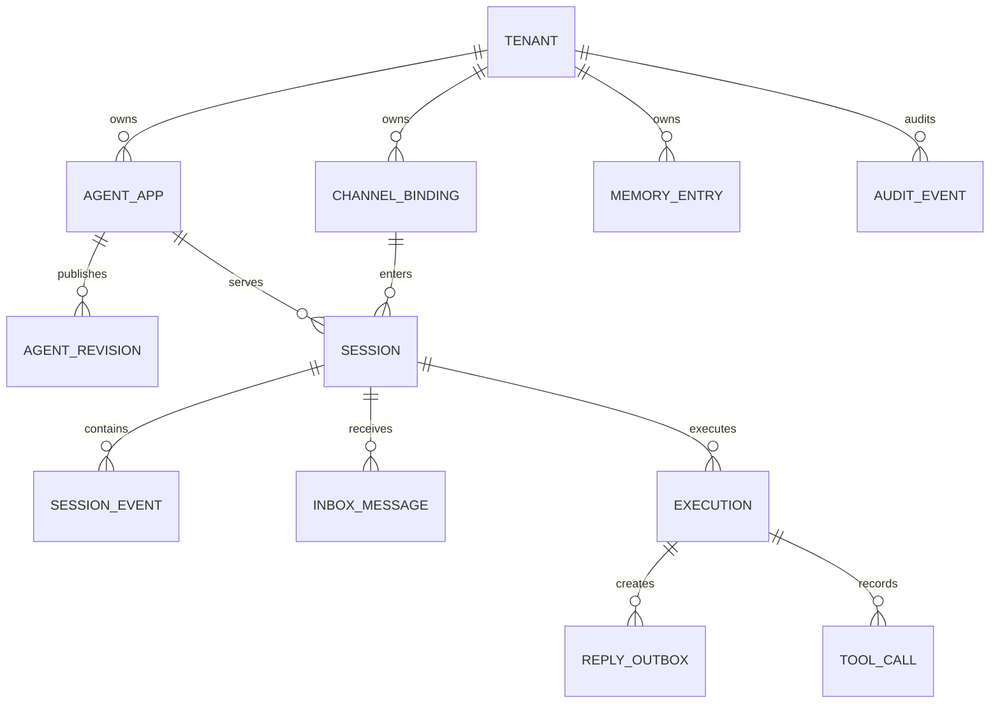

# 数据模型设计

完整 DDL 位于 `migrations/`，按控制面、可靠运行时、工具治理、知识库与补齐项分批迁移。

| 实体 | 核心字段 | 用途 |
| --- | --- | --- |
| Tenant | `tenant_id`、状态 | 租户隔离根。 |
| Agent App / Revision | 应用、修订、模型、策略、工具与知识绑定 | 发布与回滚的配置快照。 |
| Channel Binding | 通道类型、凭据引用、应用绑定 | 将 IM 账号映射到租户应用。 |
| Session | `tenant_id`、`session_pk`、用户、通道、修订、版本 | 会话事实与串行执行边界。 |
| Session Event | 会话、序号、角色、内容、执行编号 | 追加式对话历史。 |
| Inbox Message | 通道消息标识、会话、序号、状态 | 入站去重和可靠消费。 |
| Execution / Attempt | 执行状态、租约、fence、准备结果 | Worker 接管与原子提交。 |
| Reply Outbox | 回复片段、通道、投递状态 | 将事务提交与外部投递解耦。 |
| Memory / Knowledge / Artifact | 租户、用户或会话、索引和对象引用 | 长期记忆、检索和文件。 |
| Tool Call | 工具、参数摘要、结果、处置状态 | 受控工具执行账本。 |
| Audit Event | tenant、session、tool、decision、cost、trace | 可查询审计。 |

所有租户拥有的数据行都携带 `tenant_id`；关键唯一键和外键以 tenant 范围约束，避免同名
应用、会话或绑定跨租户关联。Session 版本、入站序号和 execution fence 用于并发控制。

