# 数据模型设计

> 基于 `deployments/mysql/init/001~012.sql` 事实 DDL

---

## 目录

1. [核心表结构](#1-核心表结构)
2. [表关系图](#2-表关系图)
3. [Redis 键设计](#3-redis-键设计)
4. [JSON Schema 示例](#4-json-schema-示例)

---

## 1. 核心表结构

### 1.1 租户域

#### `tenants` — 租户主表

| 字段 | 类型 | 说明 |
|---|---|---|
| `tenant_id` | VARCHAR(36) PK | 唯一标识 |
| `name` | VARCHAR(128) | 显示名称 |
| `status` | ENUM('active','disabled') | 状态 |
| `data_backend` | JSON NULL | 逐域后端选择，如 `{"session":"mysql","memory":"redis"}`（可选项：session/memory/vector/artifact/audit；summary 随 session，无独立键） |
| `audit_policy` | JSON NULL | 治理策略：`{"redact":bool,"im_allow_users":[],"tool_whitelist":[],"force_approval_tools":[]}` |
| `quota` | JSON NULL | Token 预算：`{"token_quota":int64}`，0/缺省 = 无限制 |
| `is_deleted` | TINYINT | 软删除标记 |

> **租户级“模型配置”落在哪里**：不设 `tenants.model_config` 列（阶段 44 作为死字段删除——无任何读者/写者）。租户的模型配置 = 该租户的 **`model_endpoints` 集合**（`scope='tenant'` 行；`scope='global'` 行为平台共享端点），Agent 的每个发布版本用 **`RuntimeProfile.endpoint_id`** 引用其中一个端点，因此“哪个 Agent 用哪个模型”由版本快照唯一决定，回滚版本即回滚模型。这与要求里“租户模型包含模型配置”是映射关系而非缺失：配置实体是 `model_endpoints`，归属维度是 `tenant_id`。

#### `tenant_members` — 成员与角色

登录成员表（`tenant_id` + `user_id` 主键，`role ∈ owner|admin|member`，`password_hash`）。权限模型 = 三角色 + 行级作者规则，全部在 `app/web/permission.go` 由代码推导。

> RBAC 三表 `roles` / `role_permissions` / `member_roles` 已在阶段 43 **删除**：它们既无读者也无写者（鉴权由 `tenant_members.role` + 资产 `created_by` 推导）。将来“角色变成数据”（可自定义角色）时再补回动态 RBAC schema。

### 1.2 Agent 域

#### `agents` — Agent 主表

| 字段 | 类型 | 说明 |
|---|---|---|
| `agent_id` | VARCHAR(36) PK | 唯一标识（同时充当早期 `agent_code`，故该列已删除） |
| `tenant_id` | VARCHAR(36) | 所属租户 |
| `name` | VARCHAR(128) | 显示名称 |
| `description` | VARCHAR(512) NULL | 描述 |
| `status` | ENUM('draft','published','disabled') | 生命周期状态 |
| `current_version` | INT | 当前发布版本（指向 agent_versions） |
| `created_by` | VARCHAR(64) NULL | 作者（成员 id）；NULL = 作者制上线前的老行，按租户共享处理 |
| `visibility` | ENUM('private','shared') | private = 仅作者与租户管理员；shared = 租户内只读共享 |
| `gray` | JSON NULL | 灰度发布 `{"version":N,"percent":P}`：按会话 id 稳定分桶把 P% 会话路由到第 N 版；NULL = 全量走 current_version |
| `is_deleted` | TINYINT | 软删除标记 |

#### `agent_versions` — 不可变版本快照

| 字段 | 类型 | 说明 |
|---|---|---|
| `agent_id` | VARCHAR(36) PK | 所属 Agent |
| `version` | INT PK | 单调递增版本号 |
| `runtime_profile` | JSON NOT NULL | 冻结的运行时配置（system_prompt、endpoint_id、tools、skills、policies） |
| `status` | ENUM('published','rolled_back') | 版本状态 |
| `published_at` | DATETIME | 发布时间 |

### 1.3 工具与 Skill

#### `tools` — 工具注册表

| 字段 | 类型 | 说明 |
|---|---|---|
| `tool_id` | VARCHAR(36) PK | 唯一标识 |
| `scope` | ENUM('global','tenant') | 作用域 |
| `tenant_id` | VARCHAR(36) NULL | 租户级工具所属 |
| `type` | ENUM('function','mcp') | 工具类型 |
| `definition` | JSON | OpenAPI 函数定义或 MCP 配置 |
| `risk_level` | ENUM('low','medium','high') | 风险等级 |

#### `agent_tool_grants` — 工具授权（M:N）

| 字段 | 类型 | 说明 |
|---|---|---|
| `agent_id` | VARCHAR(36) PK | Agent |
| `tool_id` | VARCHAR(36) PK | 授权工具 |

#### `skills` / `skill_versions` / `agent_skills` — Skill 资产

| 表 | 主键 | 说明 |
|---|---|---|
| `skills` | `skill_id` | Skill 主表（code、name、current_version、status） |
| `skill_versions` | `(skill_id, version)` | 版本快照（content_md、prompt_template、executor_type） |
| `agent_skills` | `(agent_id, skill_id)` | Agent-Skill 绑定（含 version 锁和 sort_order） |

### 1.4 会话与消息

#### `chat_sessions` — 会话台账

| 字段 | 类型 | 说明 |
|---|---|---|
| `session_id` | VARCHAR(128) PK | `{tenant}:{channel}:{type}:{id}` |
| `tenant_id` | VARCHAR(36) | 所属租户 |
| `agent_id` | VARCHAR(36) | 绑定的 Agent |
| `member_id` | VARCHAR(64) | IM 用户标识 |
| `channel` | VARCHAR(32) | wecom/feishu/admin |
| `status` | VARCHAR(32) | ACTIVE 等 |
| `memory_cutoff_at` | DATETIME NULL | 记忆截断时间 |

#### `chat_messages` — 对话事实记录

| 字段 | 类型 | 说明 |
|---|---|---|
| `id` | BIGINT UNSIGNED AUTO PK | 物理主键 |
| `message_id` | VARCHAR(64) UNIQUE | 消息 ID |
| `session_id` | VARCHAR(128) | 所属会话 |
| `turn_id` | VARCHAR(64) | 轮次 ID |
| `role` | VARCHAR(32) | user/assistant/tool |
| `content` | MEDIUMTEXT | 消息内容 |
| `status` | VARCHAR(32) | SUCCESS 等 |

#### 框架自建的会话/记忆表（`session/mysql`、`memory/mysql` 自动创建）

要求里的 **event / memory / summary** 三者不在平台 DDL 里，而是**框架后端在首次连接时自动建表**（平台不重复造表，Stage 34 已删除同名的平台空表）。它们是数据模型的一部分，故在此显式列出；隔离边界统一是 `app_name`，平台把 `<租户 id>` 固定为 `app_name`：

| 表（MySQL 后端） | 关键列 | 承载 | 隔离键 |
|---|---|---|---|
| `session_states` | `app_name,user_id,session_id,state JSON,updated_at,expires_at,deleted_at` | 会话级状态（含 summary 游标等）；唯一键 `(app_name,user_id,session_id,deleted_at)` | `app_name` |
| `session_events` | `app_name,user_id,session_id,event JSON,created_at,expires_at` | **会话事件流**：每轮的 user/assistant/tool 事件，`RequestID` = 入站消息 id（平台设置，用于事件级幂等与重放恢复） | `app_name` |
| `session_track_events` | `app_name,user_id,session_id,track,event JSON,…` | 分支/轨道事件（AG-UI 等分支场景） | `app_name` |
| `session_summaries` | `app_name,user_id,session_id,filter_key,summary JSON,updated_at` | **会话摘要**：按 `(app_name,user_id,session_id,filter_key)` upsert（无 created_at，覆盖写） | `app_name` |
| `app_states` / `user_states` | `app_name[,user_id],\`key\`,value,…` | 应用级/用户级状态（跨会话共享） | `app_name` |
| `memories` | `app_name,user_id,memory_id,memory_data JSON,created_at,updated_at,deleted_at`（PK `app_name,user_id,memory_id`） | **长期记忆**：`memory.Service` 的条目（Agent 经 `memory_add` 等工具显式写入，预加载按 `memory.preload_count` 注入） | `app_name` |

> 选 Redis 后端时同样的逻辑数据落在 Redis（`session:*` / `mem:{app_name:user_id}` 等键空间，见 `docs/数据同步与幂等策略.md` §3）；选 InMemory 后端则只在进程内。因此“数据模型能表达 event/memory/summary 的关系”在三种后端下都成立，只是物理载体不同。

### 1.5 IM 与投递

#### `channel_bindings` — IM 账号绑定

| 字段 | 类型 | 说明 |
|---|---|---|
| `binding_id` | VARCHAR(36) PK | 唯一标识 |
| `tenant_id` | VARCHAR(36) | 所属租户 |
| `agent_id` | VARCHAR(36) | 默认 Agent |
| `channel` | VARCHAR(32) | wecom/feishu |
| `account_id` | VARCHAR(128) | IM 账号标识 |
| `credential_ref` | VARCHAR(128) | 指向 secrets 表的凭证引用 |

#### `outbox_events` — 可靠投递邮箱

| 字段 | 类型 | 说明 |
|---|---|---|
| `event_id` | VARCHAR(36) PK | 事件 ID |
| `tenant_id` | VARCHAR(36) | 租户 |
| `topic` | VARCHAR(64) | `stream:outbound` |
| `payload` | JSON | 待投递的出站消息 |
| `status` | ENUM('pending','sent','dead') | pending=待投递；sent=已投递；dead=重试预算耗尽（或 payload 不可解析），带 `last_error` 留待人工处理 |
| `retries` | INT | 已尝试次数，驱动指数退避与终态判定 |
| `last_error` | VARCHAR(255) | 入 dead 的原因 |
| `created_at` | DATETIME | 创建时间（退避的基准时刻） |

#### `idempotency_keys` — 幂等键

| 字段 | 类型 | 说明 |
|---|---|---|
| `msg_key` | VARCHAR(128) PK | `channel:platformMsgID` |
| `tenant_id` | VARCHAR(36) | 租户 |

### 1.6 审计与用量

#### `audit_logs` — 审计日志

| 字段 | 类型 | 说明 |
|---|---|---|
| `audit_id` | VARCHAR(36) UNIQUE | 审计 ID |
| `tenant_id` | VARCHAR(36) | 租户 |
| `channel` | VARCHAR(32) | IM 通道 |
| `user_id` | VARCHAR(64) | IM 用户 |
| `session_id` | VARCHAR(128) | 会话 |
| `agent_name` | VARCHAR(128) | Agent 名称 |
| `tool_name` | VARCHAR(128) | 工具名称 |
| `decision` | VARCHAR(32) | 允许/拒绝/超时 |
| `latency_ms` | INT | 执行耗时 |
| `error_type` | VARCHAR(64) | timeout/run_error |
| `cost` | DECIMAL(12,6) | Token 成本 |
| `trace_id` | VARCHAR(64) | Jaeger trace ID |

#### `usage_records` — 用量计量

| 字段 | 类型 | 说明 |
|---|---|---|
| `record_id` | VARCHAR(36) UNIQUE | 记录 ID |
| `tenant_id` | VARCHAR(36) | 租户 |
| `agent_id` | VARCHAR(36) | Agent |
| `dimension` | VARCHAR(32) | token/tool/sandbox/artifact/skill |
| `amount` | DECIMAL(20,6) | 用量 |
| `meta` | JSON | 元数据 |

### 1.7 其他

#### `model_endpoints` — 模型端点

| 字段 | 类型 | 说明 |
|---|---|---|
| `endpoint_id` | VARCHAR(36) PK | 唯一标识 |
| `scope` | ENUM('global','tenant') | 作用域 |
| `provider` | VARCHAR(32) | openai-compatible/anthropic/gemini |
| `base_url` | VARCHAR(512) | API 地址 |
| `model_name` | VARCHAR(128) | 模型名称 |
| `api_key_ref` | VARCHAR(128) | 指向 secrets 表 |

#### `knowledge_bases` / `knowledge_documents` — 知识库

| 表 | 主键 | 说明 |
|---|---|---|
| `knowledge_bases` | `kb_id` | KB 元数据（embedding_model、collection_name、dimension） |
| `knowledge_documents` | `doc_id` | 文档摄取状态（source_uri、chunk_count、status） |

#### `secrets` — 加密凭证

| 字段 | 类型 | 说明 |
|---|---|---|
| `secret_key` | VARCHAR(255) PK | 凭证引用键（如 `endpoint:{id}`） |
| `ciphertext` | MEDIUMBLOB | AES-256-GCM 加密内容 |

#### `tenant_config_versions` — 租户配置版本

| 字段 | 类型 | 说明 |
|---|---|---|
| `tenant_id` | VARCHAR(36) | 租户 |
| `version` | INT | 单调递增版本号 |
| `config_json` | JSON | 完整配置快照 |

#### `dead_letters` — 死信队列

| 字段 | 类型 | 说明 |
|---|---|---|
| `id` | BIGINT AUTO PK | 物理主键 |
| `message_id` | VARCHAR(128) | 总线信封 ID |
| `stream_entry` | VARCHAR(64) | Redis Stream 条目 ID |
| `tenant_id` | VARCHAR(36) | 租户 |
| `agent_id` | VARCHAR(64) | Agent |
| `session_id` | VARCHAR(128) | 会话 |
| `channel` | VARCHAR(32) | IM 通道 |
| `user_id` | VARCHAR(64) | IM 用户 |
| `trace_id` | VARCHAR(64) | trace ID |
| `payload` | MEDIUMTEXT | 原始消息 JSON |
| `fail_reason` | VARCHAR(512) | 失败原因 |
| `attempts` | INT | 失败次数 |
| `replayed_at` | DATETIME NULL | 重放时间（NULL=未重放） |

---

## 2. ER 图

```mermaid
erDiagram
    tenants ||--o{ agents : "has"
    tenants ||--o{ tools : "has"
    tenants ||--o{ skills : "has"
    tenants ||--o{ model_endpoints : "has"
    tenants ||--o{ knowledge_bases : "has"
    tenants ||--o{ channel_bindings : "has"
    tenants ||--o{ audit_logs : "audits"
    tenants ||--o{ usage_records : "usage"
    tenants ||--o{ tenant_config_versions : "versions"
    tenants ||--o{ chat_sessions : "sessions"
    tenants ||--o{ tenant_members : "members"

    agents ||--o{ agent_versions : "versions"
    agents ||--o{ agent_tool_grants : "grants"
    agents ||--o{ agent_skills : "skills"
    agents ||--o{ chat_sessions : "chats"
    agents ||--o{ chat_messages : "messages"

    knowledge_bases ||--o{ knowledge_documents : "documents"

    secrets ||--o{ channel_bindings : "credential_ref"
    secrets ||--o{ model_endpoints : "api_key_ref"

    tenants {
        VARCHAR tenant_id PK
        VARCHAR name
        ENUM status
        JSON data_backend
        JSON audit_policy
        JSON quota
        TINYINT is_deleted
    }

    agents {
        VARCHAR agent_id PK
        VARCHAR tenant_id FK
        VARCHAR name
        ENUM status
        INT current_version
        VARCHAR created_by
        ENUM visibility
        JSON gray
    }

    agent_versions {
        VARCHAR agent_id PK,FK
        INT version PK
        JSON runtime_profile
        ENUM status
    }

    tools {
        VARCHAR tool_id PK
        ENUM scope
        VARCHAR tenant_id FK
        VARCHAR name
        ENUM type
        JSON definition
        ENUM risk_level
    }

    skills {
        VARCHAR skill_id PK
        ENUM scope
        VARCHAR owner_tenant_id FK
        VARCHAR code
        VARCHAR name
        INT current_version
    }

    model_endpoints {
        VARCHAR endpoint_id PK
        ENUM scope
        VARCHAR tenant_id FK
        VARCHAR name
        VARCHAR provider
        VARCHAR base_url
        VARCHAR model_name
        VARCHAR api_key_ref FK
    }

    knowledge_bases {
        VARCHAR kb_id PK
        VARCHAR tenant_id FK
        VARCHAR name
        VARCHAR embedding_model
    }

    channel_bindings {
        VARCHAR binding_id PK
        VARCHAR tenant_id FK
        VARCHAR agent_id FK
        VARCHAR channel
        VARCHAR account_id
        VARCHAR credential_ref FK
    }

    chat_sessions {
        VARCHAR session_id PK
        VARCHAR tenant_id FK
        VARCHAR agent_id FK
        VARCHAR member_id
        VARCHAR channel
    }

    chat_messages {
        BIGINT id PK
        VARCHAR message_id
        VARCHAR session_id FK
        VARCHAR turn_id
        VARCHAR role
        MEDIUMTEXT content
    }

    audit_logs {
        BIGINT id PK
        VARCHAR audit_id
        VARCHAR tenant_id FK
        VARCHAR session_id
        VARCHAR agent_name
        VARCHAR tool_name
        VARCHAR decision
        INT latency_ms
    }

    tenant_members {
        VARCHAR tenant_id PK,FK
        VARCHAR user_id PK
        ENUM role
    }

    %% ---- 框架自建（session/mysql、memory/mysql 首次连接时自动创建）----
    %% 隔离键统一为 app_name = 租户 id
    session_events {
        BIGINT id PK
        VARCHAR app_name FK "租户 id"
        VARCHAR user_id
        VARCHAR session_id
        JSON event "含 RequestID=入站消息 id"
        TIMESTAMP created_at
    }

    session_states {
        BIGINT id PK
        VARCHAR app_name FK
        VARCHAR user_id
        VARCHAR session_id
        JSON state
    }

    session_summaries {
        BIGINT id PK
        VARCHAR app_name FK
        VARCHAR user_id
        VARCHAR session_id
        VARCHAR filter_key
        JSON summary
    }

    memories {
        VARCHAR app_name PK,FK
        VARCHAR user_id PK
        VARCHAR memory_id PK
        JSON memory_data
        TIMESTAMP deleted_at
    }
```


```

**说明**：此 ER 图使用 Mermaid 语法，可在 Mermaid Live Editor (mermaid.live) 中交互查看。

---

## 3. Redis 键设计

| 键模式 | 类型 | TTL | 说明 |
|---|---|---|---|
| `stream:inbound` | Stream | 无 | 入站消息流 |
| `stream:outbound` | Stream | 无 | 出站回复流 |
| `stream:inbound:dlq` | Stream | 无 | 死信队列流 |
| `idem:{channel}:{platformMsgID}` | String | 24h | IM 消息幂等键 |
| `lock:session:{tenant}:{session}` | String | 30s | 会话分布式锁 |
| `route:{tenant}:{session}` | String | 7d | 会话路由（session → adapter+chatID） |
| `approval:req:{tenant}:{session}` | Hash | 无 | 待审批请求 |
| `approval:res:{tenant}:{session}` | String | 无 | 审批结果 |
| `retry:{streamEntryID}` | String | 24h | DLQ 重试计数器 |

---

## 4. JSON Schema 示例

### 4.1 Tenant.DataBackend

```json
{
  "session": "mysql",
  "memory": "redis",
  "vector": "milvus",
  "artifact": "minio",
  "audit": "mysql"
}
```

### 4.2 Tenant.AuditPolicy

```json
{
  "redact": true,
  "im_allow_users": ["user1", "user2"],
  "tool_whitelist": ["echo", "get_current_time", "knowledge_search"],
  "force_approval_tools": ["code-exec"]
}
```

### 4.3 Tenant.Quota

```json
{
  "token_quota": 1000000
}
```

### 4.4 Agent RuntimeProfile（agent_versions.runtime_profile）

```json
{
  "endpoint_id": "ep-123",
  "system_prompt": "You are a helpful assistant.",
  "temperature": 0.7,
  "tools": ["echo", "get_current_time", "code-exec"],
  "skills": [
    {"skill_id": "sk-1", "version": 2}
  ],
  "approval_tool_ids": ["code-exec"],
  "max_tokens": 4096
}
```
