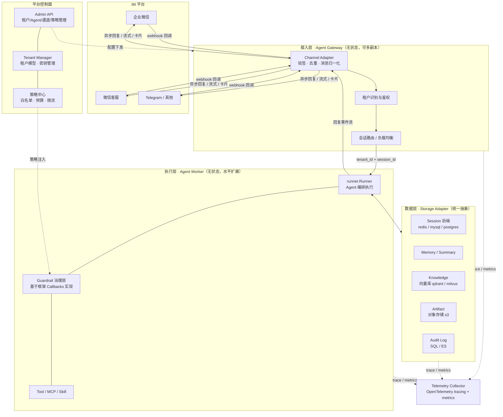
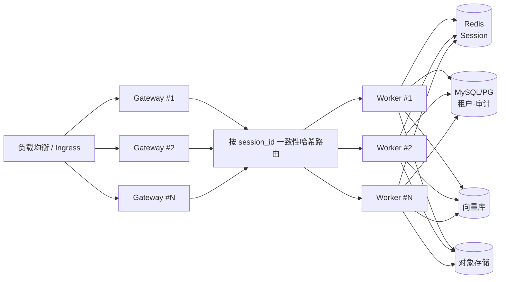
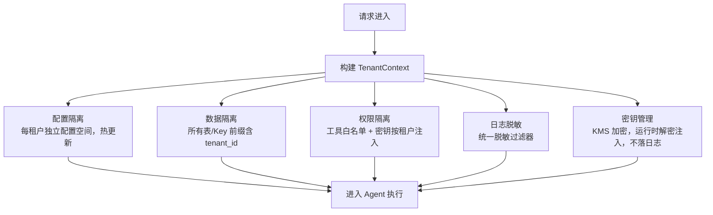
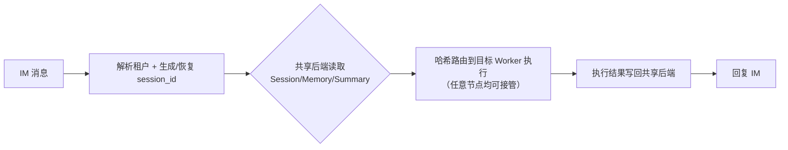
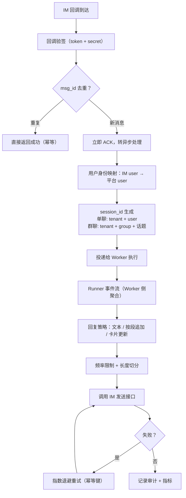
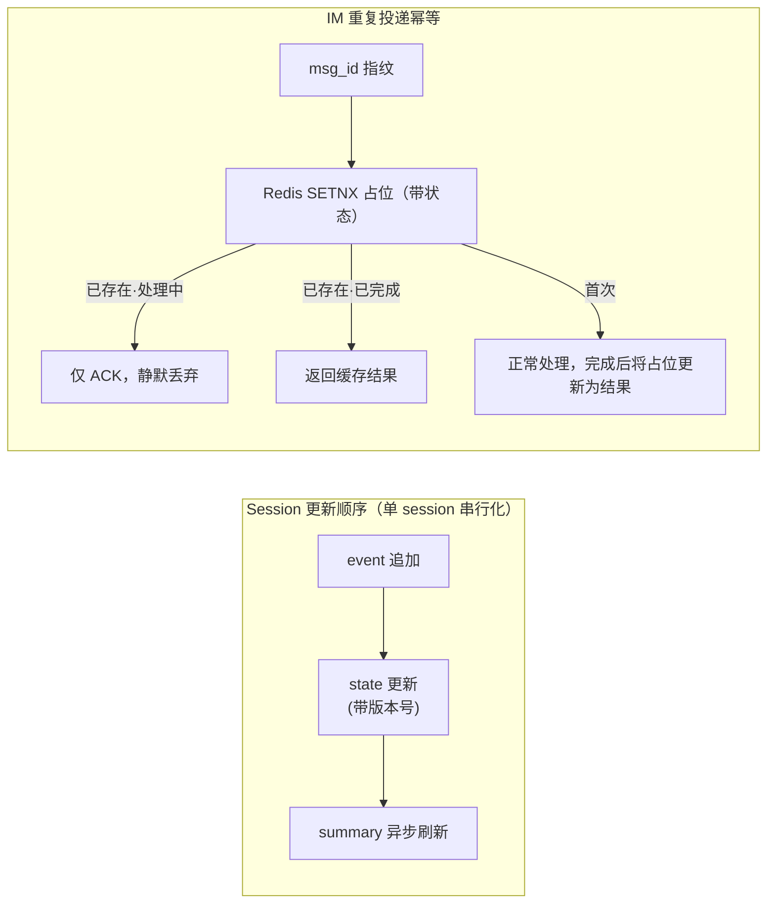
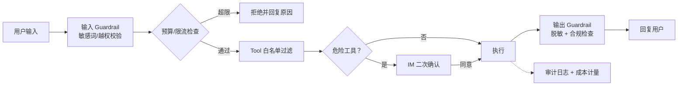
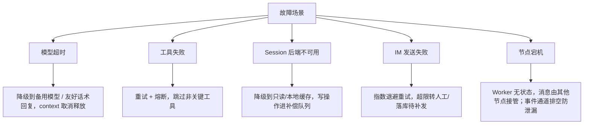
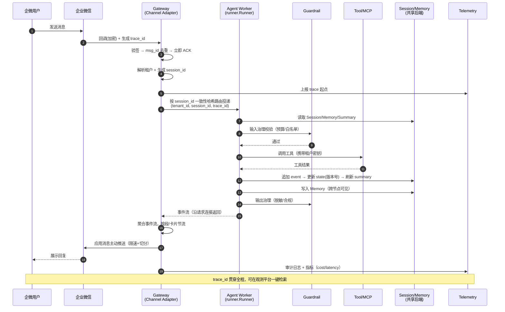
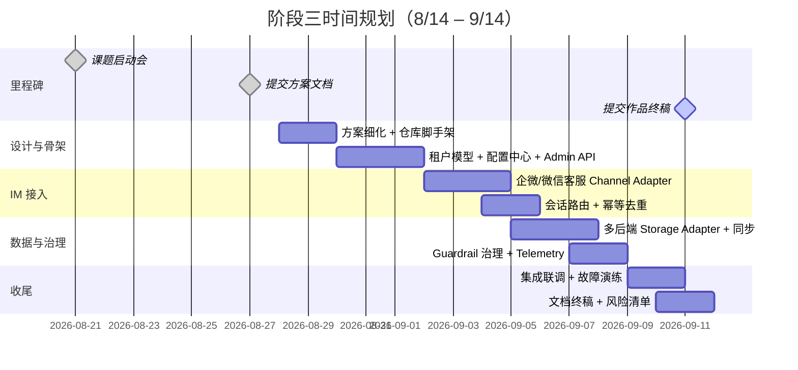

# 基于 tRPC-Agent-Go 的多租户节点化 Agent 部署平台 · 方案文档

> 阶段三课题方案（8/14 – 9/14）
> 提交节点：8/27 方案文档 ｜ 9/11 作品终稿
> 实现框架：[tRPC-Agent-Go](https://github.com/trpc-group/trpc-agent-go)

---

## 1. 设计思路

### 1.1 背景与痛点

企业落地 Agent 时，诉求不是"一个机器人"，而是**一个平台**：多个部门/业务线各自创建 Agent，分别接入企业微信、微信客服、公众号、Telegram 等不同 IM 入口，选择各自的数据后端，拥有独立的工具权限、预算与审计。核心痛点：

- **隔离难**：会话、记忆、知识库、工具权限、密钥、成本必须按租户隔离；
- **扩展难**：Agent 天然依赖 Session/Memory 上下文，但节点又要求无状态水平扩展；
- **接入难**：IM 通道存在重复投递、乱序、长度限制、异步回调，与 HTTP chat API 不同；
- **后端杂**：不同租户要求 Redis / SQL / 向量库 / 对象存储等不同后端，一致性能力各异；
- **治理难**：模型、工具、MCP、知识库、外部系统的执行链路长，监控审计必须跨组件串联。

### 1.2 总体设计原则

1. **框架能力最大化复用，平台层只做"多租户 + 节点化"增量**。Agent 编排、执行、Session/Tool/Telemetry 等直接复用 tRPC-Agent-Go，平台层聚焦租户模型、路由分发、通道绑定、后端选择与治理策略。
2. **Worker 无状态化**。不在节点本地保存会话上下文，Session/Memory/Summary 全部落共享后端，任意节点可处理任意租户的任意消息，天然支持水平扩展与故障转移，**无需 sticky session**。
3. **一切请求携带租户上下文**。以 `tenant_id` 为核心的 TenantContext 贯穿路由、执行、存储、日志、指标全链路，隔离、审计、限流、计费都挂在这一上下文上。
4. **适配层抽象**。IM 通道与存储后端均通过统一接口抽象，新通道/新后端以插件方式接入，不改动核心链路。
5. **可观测优先**。`trace_id` 从 IM 回调入口生成，贯穿 Runner 执行、Tool 调用、Session/Memory 读写到 IM 回复，审计与排障一步到位。

### 1.3 与框架的能力边界

| 平台需求 | 复用 tRPC-Agent-Go | 平台层新增 |
| --- | --- | --- |
| Agent 编排 | `agent/llmagent`、graph、Chain/Parallel/Cycle | 租户级 Agent 注册、发布与路由 |
| 执行入口 | `runner.Runner`（流式 Event、context 取消） | 多租户 Worker 调度、无状态扩展 |
| Session/Memory/Knowledge/Artifact | 框架多后端实现 | 租户级后端选择、隔离与迁移 |
| Tool / MCP / Skill | `tool`、MCP Tool、`skill` | 租户工具白名单与密钥注入 |
| 治理 | Callbacks（model/tool/agent 级回调） | 基于 Callbacks 实现 Guardrail 治理层、租户策略下发、预算与审批 |
| 服务化 | `server/openai`、`agui`、`a2a` | 统一 Gateway、Admin API |
| IM 接入 | OpenClaw Gateway + Channel 模型 | 企业微信/微信客服通道与租户绑定 |
| 可观测性 | OpenTelemetry tracing / metrics | 租户维度审计、成本与合规 |

---

## 2. 总体架构

### 2.1 系统架构图

### 2.2 组件职责

| 组件 | 职责 | 复用 / 新增 |
| --- | --- | --- |
| Agent Gateway | IM 回调接入、验签去重、消息归一化、租户识别、会话路由 | 平台新增（扩展 OpenClaw Gateway 模型） |
| Channel Adapter | 各 IM 协议双向转换、回复限速与重试 | 平台新增 |
| Agent Worker | 承载 `runner.Runner` 执行 Agent 编排，无状态 | 复用框架 + 调度增强 |
| Tenant Manager | 租户模型、配置、密钥（KMS）、生命周期 | 平台新增 |
| 策略中心 | 工具白名单、预算、限流、审批，经 Guardrail 治理层下发 | 平台新增（基于框架 Callbacks 机制实现） |
| Storage Adapter | 统一数据访问抽象，按租户路由到不同后端 | 平台新增 |
| Admin API / Web | 租户、Agent、通道绑定、策略与监控的管理界面 | 平台新增 |
| Telemetry | OpenTelemetry 全链路追踪与租户维度指标 | 复用框架 + 租户标签 |

### 2.3 部署拓扑与水平扩展

- Gateway 与 Worker 均无状态，按租户消息量独立扩缩容；
- 用户消息按 `tenant_id + session_id` 一致性哈希路由到 Worker：正常态下同一 session 的消息天然串行进入同一 Worker；Worker 宕机/扩缩容导致哈希环重排时，session 可由任意其他 Worker 接管——状态全部来自共享后端，不依赖节点本地状态；
- Gateway 以 RPC 直连 Worker，回复事件流沿同一连接返回发起请求的 Gateway 实例；任务队列（MQ）仅作为高峰削峰的可选增强，不在最小闭环内；
- 租户级配额限制单租户最大并发，防止个别租户打满集群。

---

## 3. 关键技术设计

### 3.1 多租户隔离模型

租户上下文 `TenantContext{tenant_id, 应用配置, 模型配置, 工具权限, 通道配置, 后端配置, 审计策略}` 在请求入口构建并贯穿全链路。

### 3.2 无状态节点与会话路由（不依赖 sticky session）

- **结论：不需要 sticky session**。Session/Memory 选用 `session/redis`、`session/mysql`、`session/postgres` 等共享后端，Worker 完全无状态，宕机后消息自动漂移到其他节点。
- 同一 session 的消息在入口按 `session_id` 一致性哈希串行投递（主方案），后端 state 版本号乐观锁仅作哈希环重排等极端场景下的兜底防护（见 3.4）。

### 3.3 IM 通道接入（企业微信 / 微信客服 / Telegram）

**消息全生命周期流程：**

**两类通道差异对比（验收要求）：**

| 维度 | 企业微信 | 微信客服 |
| --- | --- | --- |
| 回调模式 | 回调直接携带加密消息体（`gettoken` 仅用于获取主动发送的 access_token） | 事件通知后需主动调 `sync_msg` 拉取 |
| 验签 | URL 验证 + AES 解密 | signature + timestamp + nonce |
| 回复方式 | 主链路：先 ACK、后应用消息主动推送（被动回复限时 5s，不作主链路） | 仅允许在 48h 会话窗内回复，异步处理需在窗口内完成，超时落库待补发/转人工 |
| 消息限制 | 单条约 2048 字节，频控较严（以官方文档为准） | 文本长度受限需切分（以官方文档为准） |
| 身份 | `userid` 企业内唯一 | `external_userid` 跨企业需再映射 |
| 流式输出 | 不支持流式，Runner 事件流在 Worker 侧聚合后以"分段追加/卡片更新"节流发送 | 同上，采用分步发送 |

**session_id 与隔离**：单聊 `session = {tenant_id}:{channel}:{user_id}`；群聊 `session = {tenant_id}:{channel}:{group_id}`（可配置按话题细分）。同一用户在不同租户、不同群中的会话互不可见。

### 3.4 多后端数据存储与同步

**存储分工（多后端适配方案）：**

| 数据类型 | 推荐后端 | 一致性策略 |
| --- | --- | --- |
| Session / Event | Redis（热）或 MySQL/PG（冷/审计需求强） | event 追加 + 版本号，保证写入顺序 |
| Memory | SQL / 外部 Memory 服务 | 写后读走主库，跨节点最终一致 |
| Summary | 与 Session 同后端 | 随 session 更新异步刷新，带窗口版本号对齐 |
| Knowledge | 向量库（qdrant / milvus） | 最终一致，按租户分 collection |
| Artifact / 文件 | 对象存储（s3） | 强一致，URL 签名访问 |
| Audit Log | SQL / ES | 只追加，不可篡改 |

**数据同步关键策略：**

- **多节点并发写同一 session**：入口按 `session_id` 一致性哈希路由，同一 session 的消息串行处理（LLM 对话中后一条的回复依赖前一条的执行结果，只能串行，不能事后重排）；哈希环重排等极端场景由 state 版本号乐观锁兜底，检测到冲突即重读重放；
- **跨节点 Memory 可见性**：写入主后端后广播失效本地缓存，或直接不缓存；
- **后端迁移（Redis→SQL、本地向量库→远端）**：双写期 → 后台全量搬运 + 增量追平 → 校验 → 切读 → 停旧写。全程租户级灰度，可回滚。

### 3.5 治理、监控与安全

**租户级治理流水线（平台新增 Guardrail 治理层，基于框架 Callbacks 机制实现）：**

- **危险工具二次确认**：基于框架 graph 的 interrupt/resume 能力实现挂起—恢复（pending 状态持久化在共享后端，用户下一条 IM 消息触发恢复执行，适配无状态 Worker）；若工期不足，降级为"危险工具默认拒绝 + 白名单放行"；
- **监控指标**：请求量、模型/工具调用耗时、IM 投递成功率、错误率、token 消耗、每租户成本、Session 后端延迟，均带 `tenant_id` 标签；
- **全链路追踪**：入口生成 `trace_id`，OpenTelemetry 串起 IM callback → Runner → Tool → Session/Memory 读写 → IM 回复；
- **审计字段**：`tenant_id / channel / user_id / session_id / agent_name / tool_name / decision / latency / error_type / cost / trace_id`；
- **密钥安全**：IM token、模型 API key、数据库密码经 KMS 加密存储，运行时解密注入，日志/trace/错误报告统一脱敏。

### 3.6 故障恢复与降级

- 所有执行携带 `context.Context`，超时/取消即刻释放 goroutine，Runner 事件通道确保排空；
- **灰度发布**：按租户维度灰度（白名单租户 → 按比例放量），配置中心支持租户级秒级回滚；
- **部署形态**：最小部署 = Docker Compose（单 Gateway + 单 Worker + Redis + MySQL）；生产部署 = Kubernetes（HPA 按并发 session 扩缩 Worker，PDB 保障可用性）。

---

## 4. 核心链路时序图（验收要求）

以"企业微信用户发消息"为例，`trace_id` 贯穿全链路：

---

## 5. 数据模型概念设计（不含实现细节）

| 实体 | 关键字段（概念级） | 存储 |
| --- | --- | --- |
| Tenant | tenant_id、名称、状态、模型配置、审计策略 | SQL |
| Agent App | agent_id、tenant_id、编排类型、模型、发布版本 | SQL |
| Channel Binding | binding_id、tenant_id、channel 类型、账号凭证引用、回调配置 | SQL |
| Session | session_id、tenant_id、agent_id、channel、user、创建/更新时间 | Redis/SQL |
| Message / Event | event_id、session_id、seq、role、content、trace_id | Redis/SQL |
| Memory | memory_id、tenant_id、user/session 作用域、内容、来源 | SQL/外部服务 |
| Summary | session_id、摘要、窗口版本 | 与 Session 同后端 |
| Knowledge | tenant_id、collection、文档、向量 | 向量库 |
| Artifact | artifact_id、tenant_id、session_id、对象存储 URI | SQL + 对象存储 |
| Audit Log | trace_id、tenant_id、channel、user_id、session_id、agent_name、tool_name、decision、latency、error_type、cost | SQL/ES |

实体关系：`Tenant 1—N Agent App / Channel Binding`；`Agent App 1—N Session`；`Session 1—N Event，1—1 Summary`；`Session N—1 User`；所有实体均携带 `tenant_id` 实现隔离。

---

## 6. 预期效果

1. **验收标准全覆盖**：多租户、节点化、数据同步、多后端（≥3 类）、IM 接入（企微 + 微信客服两类差异）、全链路 `trace_id`、≥8 项风险清单、框架复用/平台新增边界说明；
2. **可运行的最小闭环**：租户创建 → 绑定企微通道 → 用户在企微对话 → Agent 调用工具 → 会话/记忆持久化 → 卡片回复，端到端演示；
3. **平台化指标**：无状态 Worker 支持任意水平扩展；单租户故障/超限不影响其他租户；会话在节点宕机后自动恢复；
4. **交付物清单**：架构设计文档（2000–4000 字）、系统架构图、核心时序图、数据模型、数据同步与幂等说明、多后端适配方案、≥8 项风险清单、GitHub 实现代码。

---

## 7. 时间规划

| 时间 | 工作内容 | 产出 |
| --- | --- | --- |
| 8/28 – 8/29 | 方案细化、仓库脚手架、CI 脚本 | 可构建的工程骨架 |
| 8/30 – 9/1 | 租户模型、配置加载、密钥管理、Admin API | 多租户基座 |
| 9/2 – 9/5 | 企微 + 微信客服 Adapter、消息归一化、会话路由、幂等 | IM 链路打通 |
| 9/5 – 9/8 | Storage Adapter（Redis/SQL/向量库/对象存储）、同步与迁移 | 数据层完成 |
| 9/7 – 9/9 | Guardrail 策略、审计、OpenTelemetry 全链路 | 治理与观测 |
| 9/9 – 9/10 | 端到端联调、故障演练、部署脚本（Compose/K8s） | 最小可运行闭环 |
| 9/11 | **提交作品终稿** | 代码 + 全套文档 + 架构图/时序图 |

**范围降级路径（工期兜底）**：

- 最小闭环优先保证**企微一条通道**端到端打通；微信客服以沙箱/mock 演示差异点（3.3 差异对比表仍覆盖验收要求）；
- 多后端以 Redis + MySQL + 向量库达标（≥ 3 类），对象存储作为 stretch goal，Adapter 接口预留；
- 危险工具二次确认若工期不足，降级为"默认拒绝 + 白名单放行"（见 3.5）。

---

## 8. 风险清单（≥8 项）

| # | 生产风险 | 影响 | 缓解措施 |
| --- | --- | --- | --- |
| 1 | IM 消息重复投递导致重复执行 | 重复回复、重复扣费 | `msg_id` 幂等键 + 结果缓存 |
| 2 | 模型服务超时/限流 | 会话堆积、用户无响应 | 超时取消、备用模型降级、队列背压 |
| 3 | 单租户流量洪峰拖垮集群 | 全局不可用 | 租户级限流/配额 + 独立队列 |
| 4 | Session 后端抖动 | 会话丢失/错乱 | 主备 + 本地降级缓存 + 补偿队列 |
| 5 | 跨节点并发写同一 session | 事件乱序、状态覆盖 | 入口哈希路由串行化为主，版本号乐观锁兜底 |
| 6 | 密钥泄露（IM token / API key） | 安全事故 | KMS 加密、最小权限、日志脱敏 |
| 7 | 工具被滥用执行危险操作 | 数据破坏、合规风险 | 白名单 + 危险操作二次确认 + 审计 |
| 8 | IM 平台接口变更/频控收紧 | 通道不可用 | 适配层隔离协议细节、限速与退避重试 |
| 9 | 后端迁移（Redis→SQL）数据不一致 | 会话丢失 | 双写 + 增量追平 + 校验 + 可回滚 |
| 10 | token 成本失控 | 预算超支 | 租户预算上限、实时计量告警 |

---

## 9. 附录

- 框架能力对照详见第 1.3 节；
- 代码目录遵循仓库 `README.md` 中的示范分层（`trpcservice/agent|channels|config|tenant|tool|...`）；
- 后续终稿将在 `docs/` 补充：详细架构设计文档、数据模型 DDL、部署手册与压测报告。
