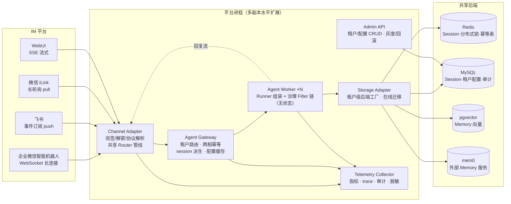
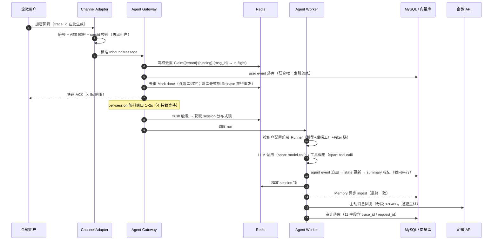

# 多租户多节点 Agent 孵化系统 · 方案文档

> 提交节点：2026-08-27 方案文档｜2026-09-11 作品终稿
> 仓库：github.com/Violet2314/trpc-agent-service（go）｜工作分支：violet/multi-tenant-agent-platform（基于 main）
> 框架：tRPC-Agent-Go（main 分支最新版）
> 本文档含：设计思路、系统架构、重点技术方案、数据模型、核心时序、故障恢复与运维、风险清单、预期效果、时间规划

---

## 1. 背景与设计思路

企业落地 Agent 应用时需要面向多个部门、多条业务线、多个 IM 入口和多种数据后端，构建统一管理的平台，而非单体机器人。本方案基于 tRPC-Agent-Go 设计并实现一个**多租户、多节点部署、支持多后端数据同步、可接入企业微信/飞书/微信等 IM 的 Agent 孵化系统**，交付可线上运行的完整实例。

调研结论（tRPC-Agent-Go main 分支）：框架已具备 Session 多后端（inmemory/redis/mysql/postgres/mongodb）、Memory 多后端（redis/mysql/pgvector/mem0 等）、Tool Filter、Runner 扩展点、OpenTelemetry、多种 Server 化模式，以及 openclaw 参考应用中的 Channel 抽象（唯一实现为 Telegram）。**企微/飞书/微信通道实现为零，租户模型、配置管理、统一数据访问、治理审计等平台层均不存在**。因此本项目的本质是"组装框架积木 + 补齐平台层"，全部新增代码落在本仓库，不侵入框架本体。

四条设计原则：

1. **无状态 Worker，状态全部下沉共享后端**——水平扩展等于加副本，从根上消除 sticky session 需求。
2. **平台无关的共享管线 + 平台特有的适配器缝隙**——IM 接入的通用逻辑（路由/去重/身份/会话）只写一遍，新增通道只注册适配器、不改主干（该分层模式已在生产级开源项目 multica 的 inbound 引擎中验证）。
3. **租户是第一维度**——配置、数据、工具权限、密钥、审计、成本全部按租户切面隔离，租户标识贯穿存储 key、指标标签与审计字段。
4. **一致性分级而非一刀切**——交互主路径（会话/配置）强一致，异步增强路径（记忆/摘要/审计）最终一致，控制成本与复杂度。

---

## 2. 系统架构

### 2.1 架构图



### 2.2 组件职责与框架复用对照（验收标准 7）

| 组件 | 平台职责 | 复用框架能力 | 新增内容 |
|---|---|---|---|
| Channel Adapter | 四通道接入：验签/解密/去重键提取/身份映射/消息转换 | openclaw `Channel` 接口模式（Telegram 实现为模板） | wecom/feishu/ilink/webui 四个适配器 + 共享 Router 管线 |
| Agent Gateway | 租户路由、两相幂等去重、session_id 派生、配置缓存、防抖触发 | `server/*` 路由模式参考 | 路由器 + 两相幂等器 + 防抖器 |
| Agent Worker | 按租户 AgentProfile 组装 Runner + 治理 Filter 链执行 | `runner.Runner`、`tool/filter`、`llmagent`、Plugin/Guardrail/Callbacks 扩展点 | Profile 组装器 + 租户级 Filter 链（白名单/脱敏/预算/二次确认/权限） |
| Storage Adapter | 租户级后端工厂 + 在线迁移编排 | `session/*`、`memory/*` 多后端实现直接实例化 | 后端工厂 + Redis→MySQL 迁移编排器 |
| Admin API | 租户/AgentProfile/通道绑定 CRUD、配置版本化、灰度回滚 | — | REST API + 版本化配置 |
| Telemetry Collector | 指标、trace 串接、审计落库、日志脱敏 | `telemetry/trace`（OTel） | 指标注册 + AuditWriter + 脱敏中间件 |

### 2.3 部署形态与 sticky session 论证

**部署形态**：代码按上述组件分模块，默认编译为单个可执行文件、同进程部署、多副本水平扩展。模块边界清晰，保留平滑演进到"Gateway/Worker/Admin 物理拆分 + 服务发现"的路径，但教学实例量级下物理拆分的独立扩缩容收益承担不起服务发现与多进程编排成本，故不作为默认形态。

**不需要 sticky session**：Worker 完全无状态，Session/Memory 全部在共享后端（Redis/MySQL/pgvector/mem0），任何副本处理任何消息都从共享后端取到同一 session；并发正确性由"每 session 一把分布式锁"保证（见 3.2）。消息路由是纯派生计算（见 3.3 session_id 规则），不依赖任何节点本地状态，因此扩容 = 加副本，缩容/故障 = 副本消失后其他副本自然接管。

**租户路由权威依据**：框架 Session 的三维 key 为 `AppName:UserID:SessionID`，平台层控制 AppName 的生成规则承载租户路由（不侵入框架）；session_id 中的 tenant 前缀是隔离校验的第二道防线，两处编码不一致即拒绝并审计。

---

## 3. 重点技术方案

### 3.1 租户模型与配置管理（控制面/数据面分离）

租户模型覆盖题目全部要素：`tenant`（租户 + 配额 + 审计/脱敏/预算策略）→ `agent_app`（模型配置、工具白名单、Session/Memory 后端选择、配置版本）→ `channel_binding`（IM 通道绑定：webhook/token/secret/验签配置、身份映射）。完整表结构见第 4 节。

配置管理采用企业 SaaS 标准的**控制面/数据面**模型：

- **控制面** = Admin API + MySQL：租户与 AgentProfile 在线读写；灰度 = 配置版本化 + 租户绑定版本，回滚 = 切回旧版本号。
- **数据面** = Worker 短 TTL 本地缓存（30s~1min）：请求路径只读本地快照，不逐请求查库。
- **资源型配置硬约束**：数据库连接、模型 key、IM token 这类资源连接型配置**不允许改值即热刷**，必须走"新资源→验证→原子切换→排空旧资源→失败回滚"，这也是后端迁移必须做平滑迁移而非改配置即切的设计根源（见 3.4）。

**租户隔离五个切面**：配置隔离（AgentProfile 按租户独立版本化）；数据隔离（存储 key 强制 tenant 前缀 + 按租户选择后端实例）；工具权限隔离（租户级白名单 Filter）；日志脱敏（统一脱敏中间件，key/token/password 一律 `${REDACTED}`）；密钥管理（表中只存 `secret_ref` 引用，真实值走环境变量/Secret 注入，明文不入库、不入日志、不入 trace）。

### 3.2 消息幂等与并发一致性（本方案答辩核心之一）

**两相幂等去重（Gateway 层）**。幂等键 = `{tenant}:{binding}:{msg_id}`——msg_id（企微 MsgId / 飞书 event_id / iLink msgid / WebUI uuid）仅在单个通道绑定内唯一，必须加租户/绑定前缀防跨租户碰撞。流程：

1. **Claim**：Redis `SET NX` 写 `in-flight` 值 + 短 TTL + owner token；已存在则判重丢弃。
2. **Mark**：入站消息落库成功后立即置为 `done`（长 TTL），终态与落库绑定。
3. **Release**：落库前失败则校验 token 后删除 claim，让 IM 平台的重发正常重入。

为什么不用简单的一相 `SETNX+TTL` 已处理表：Claim 之后 Worker 崩溃，平台重发会被误判为重复，**消息永久丢失**——两相语义（处理中/已完成分离 + 失败放行）同时防重复和防丢失。数据库层以 `(tenant_id, channel, msg_id)` 联合唯一索引兜底（Redis 故障时仍拦截重复）。企微被动回复 5 秒超时重发最多 3 次，正是该设计的现实来源，应对策略为"快速 ACK + 异步主动消息回复"。

**每 session 一把分布式锁（并发一致性）**。Redis `SET NX PX` + 租约续期，同一 session 同一时刻仅一个 Worker 执行写入，同时解决多节点并发写冲突与事件串行语义；不同 session 天然并行。两条纪律：

- **锁只包住 Runner 执行 + session 写入段**；IM 回调路径（验签→去重→落库→ACK）永不阻塞等锁，保证 5 秒 ACK 期限。
- 锁被占用时新消息已落库、防抖器待触发，当前 run 释放锁后下一次触发自然带上——不排队阻塞、不丢消息。

**更新顺序**：入站 user event 在回调路径落库（锁外，与去重 Mark 绑定）；执行期在同一把 session 锁内级联串行：追加 agent event → 更新 state → 标记/重算 summary，顺序天然确定。**防抖触发**：用户连发多条消息时 per-session 防抖窗口（1~2s）合并为一次 Runner 执行，节省模型调用且回复语境完整。

不采用消息队列方案（Redis Stream + 版本校验 + 重放）：一致性等级与锁方案相同，但多引入一个消息组件，对 IM 触达场景过度设计。

### 3.3 IM 接入层：一个抽象、四种接入模型

选型覆盖四种接入模型，验证抽象的普适性：**企业微信**（加密 webhook push，完整实现 + 协议级单测，讲师终验填真实配置）、**飞书**（事件订阅 push，自建免费 bot 真实联调）、**微信 iLink**（腾讯官方 ClawBot 协议，长轮询 pull，扫码自验，定位增强通道）、**WebUI**（SSE 流式，自验与演示用，类 DeepSeek 网页）。

**分层架构**：平台无关的**共享 Router 管线**（installation 路由 → 两相去重 → 群聊 @bot 过滤 → 身份映射 → ensure session → 落库 → 防抖触发）只写一遍；平台特有逻辑（验签/解密/协议解析/出站格式）全部隔离在各适配器的 ResolverSet 缝隙后。新增通道 = 注册一个 ResolverSet，不改 Router。入站判定用类型化 Outcome/DropReason 枚举（`ingested / dropped{duplicate, not_addressed_in_group, ...}` 等）而非布尔值，直接作为审计 decision 字段与监控指标标签。

**session_id 生成规则**：单聊 `{tenant}:{channel}:{im_user}` 稳定派生；群聊 `{tenant}:{channel}:group:{group_id}`，仅 @机器人 触发；tenant 在 key 第一段实现跨群、跨租户天然隔离。reset 策略：7 天无活跃自动重开 + 手动 `/new` 命令，reset 只清会话上下文、保留租户长期 memory。

**出站转换**（Agent Event → IM）：企微不支持流式则缓冲整段、按 2048 字节分段；飞书用卡片多次 update 模拟流式；iLink 整段被动回复（需回传 context_token，24h 过期则重建 session 并审计）；WebUI 原生 SSE 增量。**出站超时纪律**：异步回复严格小于平台 ACK 期限（飞书 3s→预算 2.5s，企微 5s→预算 4s）。

**平台限制应对**：超长消息分段 + 折叠为"查看全文"链接；每租户令牌桶限流 + 发送队列削峰；媒体消息各适配器封装 MediaSender（企微素材 API / 飞书 image_key / iLink CDN+AES）；投递失败退避重试 N 次 + 审计告警。

**企微无真实账号的验证策略**：回调协议是公开确定算法，协议级单测覆盖五个点——URL 验证握手、SHA1 验签（正确 + 篡改）、AES-256-CBC 解密回环、被动回复加密、corpid 校验（解密 corpid ≠ 配置值即拒绝，兼作租户隔离测试点）。README 写清公网 URL、IP 白名单、5 秒超时三项部署注意，讲师终验填配置零代码改动。

### 3.4 多后端数据架构与在线迁移

**接入 4 种后端，覆盖题目 6 类中的 4 类**：Redis（租户 A 的 Session + 全局分布式锁 + 幂等表）、MySQL（租户 B 的 Session + 全平台租户配置/审计/元数据）、pgvector（租户 A 的 Memory，向量库类）、mem0（租户 B 的 Memory，外部 Memory 服务类）。多后端的含义是**统一抽象 + 租户级可选择 + 可迁移**，而非全量接入所有后端；Storage Adapter 实现租户级后端工厂，按 `agent_app.backends_json` 实例化对应框架后端。

**各数据类型存储与后端选型**（统一经 Storage Adapter 路由，存储 key 均带 `tenant_id` 前缀）：

| 数据类型 | 推荐后端 | 存储内容与理由 |
|---|---|---|
| Session event / state | Redis 或 MySQL | 交互主路径，需强一致读写；租户 A/B 分别选用以验证多后端 |
| Summary | 随 Session 同后端 | 与会话 state 同生命周期，异步重算后写回 |
| Memory | pgvector 或 mem0 | 向量检索类数据；pgvector 为自建向量库，mem0 为外部 Memory 服务 |
| Knowledge | pgvector（与 Memory 同向量后端） | 知识库条目 embedding + 元数据表；检索路径与 Memory 复用向量后端 |
| Artifact | 对象存储（S3/MinIO）+ MySQL 元数据 | 文件/图片/导出物等大对象走对象存储，MySQL `artifact` 表仅存 URI、hash、租户归属 |
| Audit Log | MySQL | 结构化审计字段，支持按租户/时间范围查询与合规导出 |
| 租户配置 / 通道绑定 | MySQL | 控制面权威数据源，Worker 经短 TTL 缓存读取 |
| 幂等表 / 分布式锁 | Redis | 低延迟原子操作，不承载业务数据 |

**一致性取舍**（按数据类型分级）：

| 数据 | 一致性模型 | 机制与理由 |
|---|---|---|
| Session event/state | 强一致 | session 锁 + 原子写；交互主路径读准不乱序 |
| 租户配置 | 强一致（控制面） | Admin 改完 Worker TTL 内生效 |
| Memory 写入 | 写后最终一致 | 异步 ingest，检索允许秒级延迟；跨节点可见性由共享后端天然保证 |
| Summary | 最终一致 | 异步重算，非交互关键路径 |
| 审计日志 | 弱一致/批量落库 | 不阻塞业务 |
| 迁移期双写 | 双写 + 对账 ≈ 强一致 | 见下 |

**在线平滑迁移（Session Redis→MySQL，答辩核心之二）**：五阶段——准备（起 MySQL 后端实例）→ 双写（新写同时落两端）→ 存量回填 → 对账校验（全量比对，不一致自动重同步）→ 切读 → 停旧写；任一阶段可一键回滚。核心口径是**先回填后切读**保证用户无感知；双写一致性与切读竞态由 session 锁（3.2）覆盖——迁移操作与业务写入串在同一把锁上。向量库迁移（pgvector↔mem0）作为二期项。

### 3.5 治理、安全与可观测

**治理 Filter 链**（挂 Worker，租户级配置）：工具白名单（复用框架 `tool/filter`）→ 敏感信息脱敏 → 预算限制（token 配额 + 每租户限流）→ 危险工具二次确认（标记 `dangerous:true` 的工具调用被拦截，IM 回确认卡片，用户回复确认后作为新消息重新执行；Runner 挂起式恢复作为进阶项）→ IM 用户权限校验。

**与框架 Plugin / Guardrail / Callbacks 的对齐**：题目要求的治理机制在平台层统一收敛为 Runner 挂载的**租户级 Filter 链**——工具白名单直接复用框架 `tool/filter`；脱敏/预算/权限校验对应 Guardrail 的输入输出拦截语义；危险工具二次确认对应 Plugin 的可插拔拦截点；审计与 trace 埋点通过 OTel Callbacks 在模型调用、工具调用、Session/Memory 读写各 span 上挂接。平台不重复造轮子，而是在框架扩展点上按租户策略组装，Admin API 下发配置后 Worker 原子切换 Filter 快照。

**监控指标**（Prometheus 语义，全部带 tenant 标签）：请求量、模型调用耗时与次数、工具调用耗时、IM 投递成功/失败、错误率（按 error_type）、token 消耗、每租户成本（token×单价聚合）、Session 后端延迟。

**Trace**：复用框架 OTel 能力，trace_id 在 IM 回调入口生成，贯穿 IM callback → Gateway → Runner 执行 → 模型/工具调用 → Session/Memory 读写 → IM 回复全链路（见第 5 节时序）。

**审计日志**：11 字段（tenant_id、channel、user_id、session_id、agent_name、tool_name、decision、latency、error_type、cost、trace_id）+ 时间戳 + request_id，由共享 AuditWriter 统一写入：Gateway 记入站判定（decision 直接用 Outcome 枚举）、Worker 记执行、Telemetry 记出站。

**密钥管理**：见 3.1 隔离切面——引用制存储 + 环境变量/Secret 注入 + 全链路脱敏中间件，IM token、模型 key、DB 密码在日志/trace/错误报告中零明文。

---

## 4. 数据模型（8 张表）

```
tenant              -- 租户
  tenant_id PK, name, is_active, quota_json, policy_json(审计/脱敏/预算策略)

agent_app           -- 租户下的一个 Agent 应用
  app_id PK, tenant_id FK, app_name(复用为框架 session key 的 AppName),
  model_cfg_json, tools_allowlist_json,
  backends_json(Session/Memory 各自的后端选择), version(配置灰度/回滚)

channel_binding     -- Agent 在某 IM 通道的绑定
  binding_id PK, tenant_id FK, app_id FK, channel(wecom/feishu/ilink/webui),
  config_json(webhook/token/secret 均为 secret_ref 引用，真实值在环境变量/Secret),
  is_active, updated_at

session             -- 会话
  session_id PK, tenant_id FK, app_id FK, channel,
  user_ref(im_user 或 group_id), state_json, created_at, updated_at

message_event       -- 入站消息与 Agent 事件（合一的事件日志）
  event_id PK, session_id FK, tenant_id FK, role(user/assistant/tool),
  type, payload_json, ts, msg_id
  UNIQUE(tenant_id, channel, msg_id)   -- 幂等兜底（msg_id 仅绑定内唯一）

memory              -- 记忆条目
  memory_id PK, tenant_id FK, session_id FK, source(app/user),
  content, embedding, created_at

summary             -- 会话摘要
  summary_id PK, session_id FK, tenant_id FK, content, version, updated_at

audit_log           -- 审计（11 字段见 3.5）
  log_id PK, tenant_id, channel, user_id, session_id, agent_name,
  tool_name, decision, latency, error_type, cost, trace_id, request_id, ts
```

**扩展表**（不计入最小 8 表，终稿实现）：

- `artifact`：大对象元数据（tenant_id、uri、s3_key、content_hash、mime、created_at）；实体文件存对象存储（S3/MinIO），经 Storage Adapter 的 Artifact 接口读写。
- `knowledge`：知识库条目（tenant_id、title、content、embedding、source、created_at）；向量检索与 Memory 复用同一 pgvector/mem0 后端，经框架 `knowledge` 包实例化。

---

## 5. 核心消息链路时序（trace_id 贯穿，验收标准 5）



顺序纪律：去重终态（Mark）绑定消息落库；session 锁只包住组装→执行→session 写入段；回调路径永不阻塞等锁。任何一步失败记 error span + 审计 error_type，不中断链路其余部分。

---

## 6. 故障恢复与运维

**降级矩阵**：

| 故障 | 降级策略 |
|---|---|
| 节点故障 | 多副本 + 编排自愈；无状态 Worker 由调度重拉起，session 在共享后端不丢 |
| IM 重复投递/重试 | 两相幂等去重 + 退避重发；企微 5s 超时 → 快速 ACK + 异步主动回复 |
| DB 短暂不可用 | 配置读本地最后快照；写入队列缓冲，恢复后排空 |
| 模型超时 | context 超时取消 + 重试一次 + 降级兜底回复；模型配置支持 failover 候选 |
| 工具执行失败 | 捕获 error 返回给 Agent 纠正/降级，不中断会话 |

Go 侧资源纪律：context 取消全链路传播；Runner 事件通道排空后再退出 goroutine；pprof 监控 goroutine 数量防泄漏。

**灰度发布与回滚**：配置版本化（`agent_app.version`），租户绑定稳定版本，新版本先绑定灰度租户验证，异常一键切回旧版本；资源型配置变更走平滑迁移流程（3.1）。

**容量评估模型**：每节点并发 session 按内存/goroutine 估算（单副本约 1k 活跃 session 量级，初始估值待压测校准）；token 消耗 = 请求量 × 平均单次 token；Redis/SQL QPS = session 读写吞吐 × 副本数；IM 回调峰值按通道入口速率 × 1.5 预留。终稿附典型租户负载推演表。

**部署方案**：最小可运行 = Docker Compose（平台进程 2 副本 + redis + mysql + pgvector + mem0，`docker compose up` 即起，Admin/WebUI 同进程）；生产推荐 = Kubernetes（Deployment 跑平台进程、HPA 按请求量扩缩、StatefulSet 跑后端、ConfigMap/Secret 管配置密钥、OTLP 对接监控）。

---

## 7. 风险清单（10 条，验收标准 6）

| # | 风险 | 缓解措施 |
|---|---|---|
| 1 | 租户数据串扰（A 读到 B 数据） | 存储 key 强制 tenant 前缀 + 按租户隔离后端连接 + corpid/租户校验单测 + 审计抽检 |
| 2 | IM 消息重复投递（企微 5s 超时重发） | 两相去重 Claim/Mark/Release + DB 联合唯一索引；处理中崩溃走 Release 重入，防重复且防丢失 |
| 3 | 分布式锁租约过期 / 持锁 Worker 宕机 | 锁值绑定实例 + 租约续期 + 释放前校验锁值；写操作幂等可重入 |
| 4 | Redis 单点故障（锁/去重/Session 依赖） | 哨兵/集群部署；降级：DB 唯一索引兜底去重、session 暂时只读 |
| 5 | 模型 API 超时/限流/宕机 | 超时取消 + 有限重试 + 兜底回复；模型 failover 候选配置 |
| 6 | 密钥泄漏（日志/trace 明文） | 脱敏中间件强制 + secret_ref 引用制 + 密钥格式扫描告警 |
| 7 | 迁移双写期数据不一致 | 对账阶段全量比对 + 不一致自动重同步 + 一键回滚旧后端 |
| 8 | 恶意租户刷配额 / 成本失控 | 租户级预算 Filter + 每租户限流 + token 配额告警 |
| 9 | goroutine / 事件通道泄漏 | context 取消传播 + 事件通道排空退出 + pprof 监控 |
| 10 | 配置热更新引发运行时错乱 | 配置版本化 + Worker 原子切换快照 + 资源型配置走平滑迁移 |

---

## 8. 预期效果与验收对照

交付：可 `docker compose up` 一键启动的完整多租户 Agent 平台实例 + 本文档 + 终稿实现代码。演示路径：Admin API 创建两个租户（分别绑定 Redis/MySQL Session、pgvector/mem0 Memory）→ WebUI/飞书真实对话验证隔离 → 企微协议级单测全绿 → 迁移命令在线切换租户 A 的 Session 后端 → Grafana/日志查看每租户指标与审计。

| 题目验收标准 | 本方案覆盖处 |
|---|---|
| 1 覆盖多租户/节点化/数据同步/多后端/IM/治理监控/故障恢复 | §2 / §3.1-3.5 / §6 |
| 2 数据模型表达 8 类实体关系 | §4（8 表 + Artifact/Knowledge） |
| 3 至少两种 IM 接入差异（含微信或企微） | §3.3（企微/飞书/iLink/WebUI 四种接入模型对比） |
| 4 至少三类后端的存储与同步策略 | §3.4（Redis/MySQL/pgvector/mem0 四类 + 一致性分级） |
| 5 完整链路时序 + trace_id 贯穿 | §5 |
| 6 ≥8 条生产风险与缓解 | §7（10 条） |
| 7 框架复用 vs 平台新增 | §2.2 对照表 |

---

## 9. 时间规划（8/27 → 9/11，AI 辅助开发）

| 时段 | 目标 | 优先级 |
|---|---|---|
| 8/27–8/30 | 仓库骨架 + 租户模型/8 表迁移 + Admin API + Gateway（两相幂等/路由/session 锁/防抖） | P0 |
| 8/31–9/3 | Channel Adapter：共享 Router 管线 + WebUI(SSE) + 飞书（真实联调）+ 企微（完整实现 + 协议级单测五点） | P0 |
| 9/1–9/4 | 微信 iLink 通道（长轮询 + context_token 缓存，扫码自验） | P1 |
| 9/4–9/7 | Storage Adapter 后端工厂（4 后端）+ Redis→MySQL 在线迁移 + 治理 Filter 链 + 审计/指标/OTel 串接 | P0 |
| 9/8–9/11 | Compose/K8s 部署 + 端到端联调 + 容量推演/灰度演示 + 终稿文档 | P0 |
| 随进度 | 危险工具挂起式确认（进阶档）、tencentdb 第三 Memory、向量库迁移 C2 | P2 |

P0 为验收必需路径；P1 失败不影响"至少两种 IM"硬要求；P2 为有余力的企业级增强。配置全部外置（Admin API/环境变量），讲师终验填真实企微配置零代码改动。
