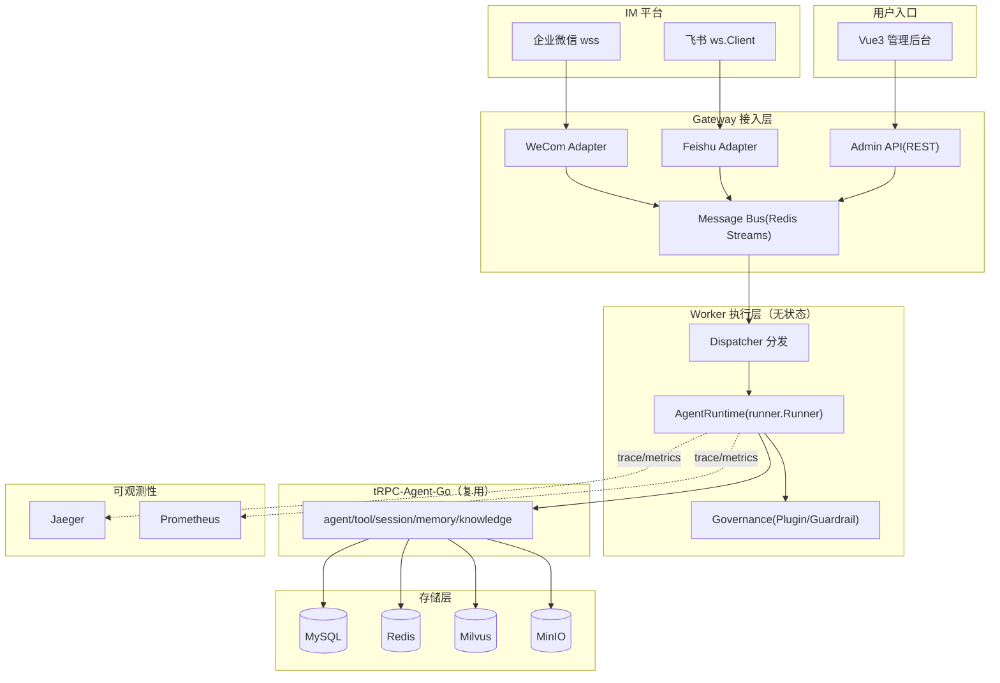
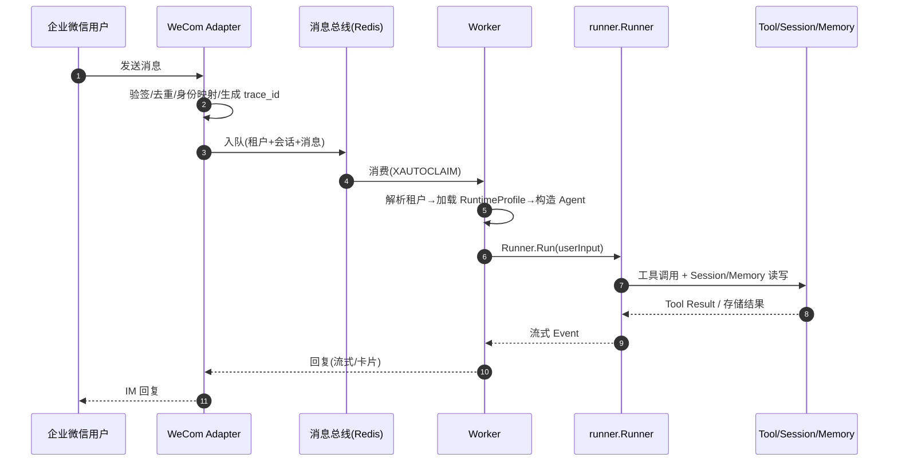

# 架构设计文档

> 版本：V1.0　｜　阶段：1（详细设计）　｜　字数：约 3200 字
> 关联文档：《详细设计文档》（表结构/接口/目录）、《多后端适配方案》、《技术选型与风险清单》、《平台架构设计草案》

## 一、概述与设计目标

本平台基于 tRPC-Agent-Go 构建企业级多租户节点化 Agent 部署平台，将 Agent 能力从单点 demo 扩展为平台化服务。核心目标：

1. **多租户隔离**：租户之间隔离会话、记忆、知识库、工具权限、审计日志与成本。
2. **弹性部署**：Agent Worker 无状态化，支持多节点水平扩展。
3. **多 IM 触达**：企业微信、飞书统一接入，消息路由、会话关联与回复。
4. **数据一致性**：跨节点共享 Session/Memory，事件有序、消息幂等。
5. **后端可替换**：租户级选择数据后端（MySQL/Redis/Milvus/MinIO）。
6. **审计合规**：全链路追踪、审计日志、密钥脱敏。

设计遵循一条总原则：**复用 tRPC-Agent-Go 已有的 Agent 编排、Tool、Session、Memory、Knowledge、Artifact、Plugin/Guardrail 与可观测性能力，平台层只补足「多租户治理、节点编排、消息总线、IM 适配、后端路由」这五块框架未覆盖的能力**。

## 二、总体架构

**分层职责**：

| 层 | 组件 | 职责 |
| --- | --- | --- |
| 接入层 | Gateway | Admin API 的租户/Agent/工具/知识库/IM 配置 CRUD；企业微信/飞书 WSS 适配；租户解析、鉴权、验签去重、trace_id 生成、消息入队 |
| 执行层 | Worker | 消费消息、会话路由、构造租户 Agent、调用 `runner.Runner` 执行、治理校验、回流回复 |
| 复用层 | tRPC-Agent-Go | Agent 编排（LLMAgent/GraphAgent）、Tool（FunctionTool/MCP）、Session/Memory/Knowledge、Plugin/Guardrail |
| 存储层 | MySQL/Redis/Milvus/MinIO | 强一致业务数据 / 队列缓存锁 / 向量检索 / 产物文件 |
| 可观测性 | Jaeger/Prometheus | 分布式追踪、业务指标 |

## 三、核心设计决策

### 3.1 单一二进制 + 角色标志

后端编译为**单一二进制**，通过 `--role=gateway|worker|admin|all` 启动不同角色。本地/Docker Compose 用 `all` 快速跑通；K8s 生产按角色拆 Deployment 独立伸缩。这与参考实现的思路一致，但所有实现落到 tRPC-Agent-Go 官方 API。

### 3.2 无状态 Worker + 共享状态层

Worker 不持有会话本地状态，任意节点可处理任意会话，因此**无需 sticky session**。会话与记忆依赖共享后端（`session/redis`、`session/mysql`）实现跨节点一致访问。这是解决「Agent 天然依赖 Session/Memory/Summary 上下文」与「水平扩展」矛盾的关键——把状态从 Worker 进程剥离到共享存储层。

### 3.3 统一消息总线（Redis Streams）

IM 适配器与 Admin 统一向 Redis Streams 投递标准化消息，Worker 以 Consumer Group 消费。选 Redis Streams 而非独立 MQ 的理由：Redis 已作为强制依赖存在，Streams 原生支持消费者组、`XAUTOCLAIM` 故障认领、消息 ID 幂等，避免引入额外中间件。

### 3.4 不可变运行时画像 + 版本发布回滚

每次发布 Agent 生成**不可变版本**（冻结 system_prompt、模型端点、工具、知识库、Skill、治理策略），回滚即切换版本指针，Worker 无感。这为灰度发布与租户级配置回滚提供原子能力。

### 3.5 租户级后端选择

数据域（session/memory/summary/artifact/vector/audit）逐域可选后端，`storage.Router` 按 `tenant_id` 路由到具体实现。租户 A 可用 Redis session、租户 B 可用 MySQL session，无需改代码。

## 四、核心时序

`trace_id` 在 Adapter 入站时生成，随 `bus.Message.TraceID` 贯穿 Channel → Dispatch → Worker → Runner → Tool → Session/Memory 写入 → Reply 全链路，经 OpenTelemetry 上报 Jaeger。

## 五、数据同步与多后端

- **一致性取舍**：MySQL 强一致（权威）、Redis 最终一致（缓存/队列）、Milvus 最终一致（向量）、MinIO 强一致（S3 对象）。
- **并发写 session**：Redis 会话锁 + 事件单调 seq + MySQL 事务。
- **event/state/summary 顺序**：event 先落（seq 递增）→ state 更新 → summary 按 seq 水位增量更新。
- **跨节点 Memory 可见**：写 Redis（原子 Lua）+ 异步落 MySQL，读走 Redis。
- **后端迁移**：双写过渡 + 回填 + 灰度切换；向量库可离线重建、对象存储可整体搬迁。
- **幂等**：`idem:{msg_key}` SETNX + MySQL 唯一键，保证 IM 重复投递 exactly-once。

详见《详细设计文档》§7 与《多后端适配方案》。

## 六、治理、监控与安全

- **治理（复用 plugin）**：工具白名单、敏感信息脱敏、预算限制（每 Run token/工具上限）、危险工具二次确认（`plugin/guardrail/approval`）、IM 用户权限校验。
- **监控**：会话数、消息数、模型/工具延迟、IM 投递成功率、错误率、token 消耗、每租户成本、队列积压、审批等待时长、Session 后端延迟。
- **安全**：默认不信任模型输出，授权由后端可信上下文判定；密钥经 Secret 引用注入，日志/trace 全脱敏，不落明文。

## 七、故障恢复与运维

- **节点故障**：Redis Streams `XAUTOCLAIM` 认领未确认消息 + Outbox 补偿重发。
- **IM 重试**：幂等去重 + 有界重试 + DLQ。
- **模型超时**：`context.Context` 取消 + Runner 事件通道排空 + goroutine 生命周期管理，避免泄漏。
- **工具失败**：结构化错误返回模型可换方案，记录审计。
- **灰度回滚**：不可变版本发布/回滚。
- **容量评估**：每节点 200~500 并发 session，瓶颈在模型调用与 Session 后端延迟，Worker 无状态可线性扩展。

## 八、部署拓扑

- **最小可运行**：Docker Compose 单二进制 `--role=all` + MySQL + Redis + Milvus + MinIO + Jaeger + Prometheus。
- **生产推荐**：K8s 下 gateway（对外）+ worker（多副本，HPA 按队列积压/CPU）+ 存储中间件；ConfigMap/Secret 分离、健康检查、滚动更新。

---

## 附：复用边界（框架 vs 平台层）

| 能力 | 复用 tRPC-Agent-Go | 平台层新增 |
| --- | --- | --- |
| Agent 编排 / 执行入口 | `agent/llmagent`、`agent/graph`、`runner.Runner` | 租户级 Agent 注册、版本发布/回滚 |
| Tool / MCP | `tool/function`、`tool/mcp` | 工具注册 + RBAC 白名单 |
| Session / Memory / Summary | `session/*`、`memory/*` | 租户级后端路由 + 隔离 |
| Knowledge | `knowledge/*` + `storage/milvus` | 知识库 CRUD + 租户隔离 |
| Artifact / 对象存储 | `artifact/*` + `storage/s3`（MinIO） | 产物元数据 + 签名下载 |
| 治理 | `plugin/guardrail`（含 approval） | 租户策略下发、预算、审批流程 |
| 沙箱/代码执行 | `codeexecutor`（local/container/sandbox） | K8s 后端（补 `CodeExecutor` 实现） |
| 模型 | `model/openai`（WithBaseURL/WithAPIKey） | ModelEndpoint 归一化层 |
| HTTP 服务化 | `server/openai`、`server/agui`、`server/a2a` | Admin REST API |
| IM 通道 | `openclaw` channel 模型（借鉴） | IMAdapter 接口 + wecom/feishu 实现 |
| 可观测性 | OpenTelemetry tracing/metrics | 租户维度审计、成本统计 |
