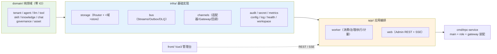

# 多租户 Agent 平台架构设计文档

> 版本：2.1 · 分支：feature/WangAnxin · 全部结论以仓库真实代码为准（含实测与回归测试证据）
>
> **阅读指引**：题目「建议 2000–4000 字」，本文正文（§1–§9）即对应要求内容；
> §10 起是**实现对照、复用边界与取舍说明**（篇幅更长，供深入阅读/答辩使用），
> 可按需跳读。每节都标注了对应代码位置，便于逐条核对。

**配套图表**（源文件为 Mermaid，可直接改）：

| 图 | 文件 | 说明 |
| --- | --- | --- |
| 系统架构图 | `docs/系统架构图.mmd` / `.png` | 分层、组件、消息与数据流向 |
| 核心时序图 | `docs/核心时序图.mmd` / `.png` | 一条 IM 消息的完整生命周期（含附件、审批挂起、Outbox 派发） |
| 部署拓扑图 | `docs/部署拓扑图.mmd` / `.png` | Docker Compose 全栈、端口映射、profile 分层 |
| 审批时序图 | `docs/审批时序图.mmd` / `.png` | 人工审批的同步挂起与"无锁识别回复" |
| 幂等与重投时序图 | `docs/幂等与重投时序图.mmd` / `.png` | 重复投递 / 崩溃恢复 / 中毒消息三条路径 |
| ER 图 | `docs/ER图.mmd` / `.png` | 业务表结构（框架自建表另见《数据模型设计》） |

---

## 目录

1. [平台概述](#1-平台概述)
2. [架构分层](#2-架构分层)
3. [多租户隔离与权限模型](#3-多租户隔离与权限模型)
4. [节点部署拓扑](#4-节点部署拓扑)
5. [消息流转链路](#5-消息流转链路)
6. [数据层设计](#6-数据层设计)
7. [IM 通道接入](#7-im-通道接入)
8. [治理与可观测性](#8-治理与可观测性)
9. [故障恢复与运维](#9-故障恢复与运维)
10. [tRPC-Agent-Go 复用与新增模块](#10-trpc-agent-go-复用与新增模块)
11. [管理前端架构](#11-管理前端架构)
12. [测试策略](#12-测试策略)
13. [扩展指南：如何再加一个后端 / 通道 / 工具](#13-扩展指南如何再加一个后端--通道--工具)
14. [需求对照与已知边界](#14-需求对照与已知边界)

---

## 1. 平台概述

本平台基于 **tRPC-Agent-Go v1.11.2** 构建，以单一 Go 二进制承载 **四种节点角色**
（`all` / `admin` / `worker` / `gateway`，见 §4.1），支持：

- **多租户隔离**：配置、数据、工具权限、密钥、审计、成本六个维度独立隔离，并有**行级**资产归属规则
- **多 IM 通道**：企业微信（WeCom WSS）、飞书（Lark WebSocket **或** HTTP 事件订阅）、Admin Chat（HTTP + SSE）
- **无状态 Worker**：Agent 执行层不持有本地状态，Session/Memory/Summary 统一由共享后端管理，不需要 sticky session
- **可插拔数据后端**：Session、Memory、Vector、Artifact、Audit 五个域均可**逐租户**选择后端
- **可靠消息投递**：Redis Streams + MySQL Outbox + 死信队列（DLQ）三级保障，重复投递/崩溃/中毒消息各自有确定语义
- **可观测与合规**：一条 trace 贯穿 IM→Runner→Tool→Session/Memory→回复；审计字段 11 项齐全且可按来源/决策/操作者筛选

**技术栈**：Go 1.26 · 标准库 `net/http`（Go 1.22+ 方法+路径路由，未引入第三方 router）· `database/sql` 手写 SQL · Redis Streams · MySQL 8.0 · Milvus v2.5.6 · MinIO（S3 兼容）· OpenTelemetry + Jaeger · Prometheus · Vue3 + Vite + Pinia + Element Plus


---

## 2. 架构分层

代码按 **`domain ← infra ← app`** 单向依赖组织（禁止反向），`cmd/` 是唯一装配点：



| 层 | 职责 | 对应代码包 |
| --- | --- | --- |
| **domain** | 领域模型、`Store` 接口、内存默认实现；纯逻辑零 IO | `trpcservice/domain/*` |
| **infra** | 持久化（MySQL 实现集中在 `infra/storage/<域>store/`）、消息总线、IM 通道、审计、密钥、指标、配置、日志、健康检查、沙箱 | `trpcservice/infra/*` |
| **app** | 应用编排：worker（消费循环/治理/执行/计量）、web（管理 REST + SSE + 回调入口） | `trpcservice/app/*` |
| **cmd** | 组合根：按 `-role` 装配节点能力、装配数据面与 IM 网关 | `cmd/trpc-service/*` |
| **front** | Vue3 管理台（路由守卫 + 权限位 + 各资产页 + 对话/历史页） | `front/src/*` |
| **framework** | Agent 编排、Runner、Session/Memory/Tool、审批、制品、外置化（全部 `import` 复用，不复制源码） | `trpc-agent-go` |

> 分层约束是**可验证**的：`infra` 不 import `app`，`domain` 不 import `infra`；
> 唯一的例外通道是 `cmd` 的装配代码。历史上的"领域包内嵌 MySQL 实现"已在阶段 32 全部迁出。

---

## 3. 多租户隔离与权限模型

### 3.1 租户数据结构

```go
type Tenant struct {
    ID          string            // 唯一租户标识
    Name        string            // 显示名称
    Status      string            // "active" | "disabled"
    DataBackend map[string]string // 逐域后端选择: session/memory/vector/artifact/audit
    Quota       *Quota            // 租户级 Token 预算 (0 或 nil = 无限制)
    AuditPolicy *AuditPolicy      // 治理策略
}
```

`DataBackend` 域键定义（`domain/tenant/tenant.go` 常量 `Domain*`）：

| 域        | 键          | 可选后端                           | 路由实现 |
| -------- | ---------- | ------------------------------ | --- |
| Session  | `session`  | `inmemory` / `redis` / `mysql` | `Router.Sessions`（`backends.backendTable`） |
| Memory   | `memory`   | `inmemory` / `redis` / `mysql` | `Router.Memories`（同一张表） |
| Vector   | `vector`   | `inmemory` / `milvus`          | `NewRouterVectorFactory` 包装 |
| Artifact | `artifact` | `inmemory` / `minio`           | `NewRouterArtifactService` 包装 |
| Audit    | `audit`    | `inmemory` / `mysql`           | `NewRouterAuditRecorder` 包装 |

Summary 不独立路由——摘要活在 Session 后端里（框架 `session/mysql` 建 `session_summaries` 表），
因此 `tenants.data_backend` 中没有 `summary` 键，平台也不提供摘要 API。

### 3.2 审计策略字段

```go
type AuditPolicy struct {
    Redact             *bool    // PII 脱敏开关 (nil = 默认开启)
    IMAllowUsers       []string // IM 用户白名单 (空 = 允许全部)
    ToolWhitelist      []string // 工具白名单 (空 = 不限制；knowledge_search 豁免)
    ForceApprovalTools []string // 强制人工审批的工具 (与 agent 级、risk_level 取并集)
}
```

### 3.4 认证与授权模型（三层闸门）

| 层 | 实现 | 拒绝语义 |
| --- | --- | --- |
| **① 认证** | `POST /auth/login`（bcrypt 校验）签发 JWT；`AuthMiddleware.Wrap` 对除跳过表外的所有路径要求 `Authorization: Bearer`。跳过表 = `/healthz`、`/auth/login`，以及**前缀匹配**的 `/webhooks/im/`（平台回调只有签名，没有会话）。生产模式缺签名密钥直接拒绝启动 | 401 |
| **② 路由级权限** | `RequireRoutePermission` + `routePermission(path)`：把路径映射到权限位（`tenant:manage` / `member:manage` / `secret:manage` / `audit:read` / `usage:read` / `chat` / `dlq:manage` …），再与 `rolePermissions[role]` 比对 | 403 |
| **③ 资源级（按 id）** | `web/permission.go`：`ScopeTenant`（非 owner 即便**省略** `?tenant_id=` 也钉死自己的租户）、`ClaimTenant`（写入锚定调用者租户，仅 owner 可指定他租户）、`TenantAccessible`/`EndpointAccessible`（全局资产视为平台共享）、`CanReadAsset`/`CanManageAsset`（行级作者规则） | **统一 404**（不确认外部资源是否存在，避免把 id 当探针） |

**三种角色的边界**（`member.Role*`）：

| 角色 | 范围 | 能做 | 不能做 |
| --- | --- | --- | --- |
| `owner` | 全平台所有租户 | 建/删租户、建 global 资产、跨租户查看、一切管理动作 | —— |
| `admin` | 单个租户 | 管理本租户全部资产、成员、密钥、审计、用量、DLQ | 跨租户；建 global 资产；改租户本身 |
| `member` | 单个租户 | 创建并共享自己的资产（KB/Skill/端点/Agent/IM 绑定）、给 Agent 授权工具、对话、查看**自己的**用量 | 成员与密钥管理、审计；改别人的行（只能读 shared 行） |

**资产可见性（作者制 + 显式共享）**：`private`（默认，仅作者与管理员可读）、`shared`（本租户可读，仅作者/管理员可写）；
**老数据兜底**：`created_by` 为空的历史资产按"租户共享"处理（不造假作者、不跑 backfill），回归测试 `TestLegacyAssetsWithoutAuthorStayVisible`。

### 3.5 六维隔离的代码落点

| 隔离维度 | 实现方式 | 代码位置 |
| --- | --- | --- |
| **配置隔离** | 每个租户的 Agent / Endpoint / Tool / Skill / KB / Channel Binding 独立存储，按 `tenant_id` 关联加载 | 各 `<域>store` 的 `WHERE tenant_id = ?` |
| **数据隔离** | MySQL 行级 `tenant_id` 过滤；Redis 键按 `{tenant}:` 前缀；Session/Memory 走框架 `AppName = tenant_id` | `bus.keyBuilder`、`Router`、`runner.NewRunner(tenantID, …)` |
| **工具权限隔离** | `agent_tool_grants` 行级授权 + 租户 `tool_whitelist` + `force_approval_tools` | `domain/tool`、`app/worker/policy.go` |
| **密钥隔离** | AES-256-GCM 加密的 secret store；绑定用 `credential_ref`/`verification_token_ref` 引用；日志正则脱敏 | `infra/secret`、`infra/log` |
| **审计与日志脱敏** | `audit_logs` 携带 tenant/user/session/trace；错误只落粗粒度分类；日志敏感 attr 自动 `***` | `infra/audit`、`infra/log.redactHandler` |
| **成本隔离** | `quota.token_quota` 预算熔断；`usage_records` 五维度幂等计量并按触发人归属 | `app/worker/{policy.go,usage_meter.go}` |

---

## 4. 节点部署拓扑

### 4.1 单二进制多角色

单一二进制通过 `-role` 标志选择角色，`cmd/trpc-service/role.go planFor` 是**唯一**的角色定义表；
未知角色直接报错退出（不做静默兜底，避免拼错就得到一个"什么都不会做"的节点）：

| 角色 | 管理 REST API | 对话 API（`/chat`+SSE、`/sessions`） | Worker 消费循环 + Outbox 派发 | IM 网关（连接 + 出站分发） |
| --- | --- | --- | --- | --- |
| `all`（默认） | ✅ | ✅ | ✅ | ✅ |
| `admin` | ✅ | ❌ | ❌ | ❌ |
| `worker` | ❌ | ✅ | ✅ | ❌ |
| `gateway` | ❌ | ❌ | ❌ | ✅ |

设计意图：**管理面与数据面分离**——被攻陷的数据面节点无法改写平台配置；
对话接口跟着 worker 走（`POST /chat` 只是把消息投进总线，没有消费者的节点不应接受对话）；
DLQ 管理虽然面向运维，但只在跑 worker 的节点上才有意义。
（阶段 44 修过一次"角色语义倒挂"：当时 admin 节点竟在跑消费循环、worker 节点却暴露管理 API，
用 4 个真实节点的探针脚本才暴露出来，现在有 `role_test.go` 固化矩阵。）

### 4.2 生产部署拓扑（Docker Compose）

完整拓扑见 **`docs/部署拓扑图.mmd`**（含端口映射与 profile 分层）。要点：

| 服务 | 镜像 / 说明 | 宿主端口 | 所属 profile |
| --- | --- | --- | --- |
| `backend` | 本项目二进制，`-role all` | 8080 | 默认 |
| `frontend` | Nginx + Vue3 静态产物，`/api/*` 反代 `backend:8080` | 5173 | 默认 |
| `mysql` | MySQL 8.0，`mysql/init/*.sql` **仅首次建卷时执行** | 3307 | 默认 |
| `redis` | Redis 7（总线/锁/幂等/路由） | 6379 | 默认 |
| `milvus` + `etcd` + `minio` | 向量库及其依赖（Milvus ≥ 2.5 才有 BM25） | 19530 / 9091 | `full` |
| `artifact-minio` | 制品与附件归档（与 Milvus 的 MinIO 分开，避免生命周期互相影响） | 9002 / 9003 | `full` |
| `otel-collector` / `jaeger` / `prometheus` | 可观测栈 | 4317/4318/8889 · 16686 · 9090 | `observability`/`full` |

`begin.sh` 是唯一推荐入口：`./begin.sh`（起全栈并等健康）、`up/down/status/logs/reset`；
`reset` 会精确删除数据卷以重跑 init 脚本（因为有"init 只在首次建卷执行"这个坑）。

> **K8s 清单已按决策移除**（阶段 25）：生产形态确定为 Docker Compose 单机/多节点，
> 维护两套清单属于双份维护成本。若将来迁 K8s，需要补的是 HPA 与 Pod 内的执行后端
> （Pod 里没有 docker socket，`DockerExecutor` 不可用，靠 `CodeExecutor` 窄接口替换实现）。

### 4.3 多节点水平扩展

**Worker 无状态设计**：Worker 不持有本地 Session 状态，所有状态由 Redis Streams + 共享存储后端管理。

**不需要 Sticky Session**，理由逐条可查：

1. **Session 后端共享**：`storage.Router` 按 `Tenant.DataBackend` 解析到共享的 Redis/MySQL Session 服务，所有 Worker 操作同一后端；
2. **Consumer Group 天然扇出**：Redis Streams 的 `workers` 消费组保证一条消息只被一个消费者取走；
3. **会话锁序列化**：`lock:session:{tenant}:{session}`（30s TTL + 心跳续期 + Lua compare-and-delete）保证同一会话同一时刻只有一个 Worker 在处理；
4. **幂等在更外层兜底**：即使部署出错（两个消费者同时拿到消息），`idem:{msgID}` 租约 + `idempotency_keys` 唯一键仍能保证"只执行一次、只回复一次"。

**并发控制**：`consumeWorkers`（默认 16）限制每节点同时处理的会话数；一次回合最长 `runTimeout=300s`，
审批等待再叠加 5 分钟，期间由单个心跳 ticker 同时续会话锁与幂等租约（TTL 分别是 30s/90s，不续期就会在中途失效）。

### 4.4 用户消息路由到正确租户和 Session

```
IM 消息 → Adapter.Inbound() → Gateway.pumpInbound()
         → 按 binding(account_id) 解析 tenant_id + agent_id（未绑定则丢弃并 warn）
         → BuildSessionID(tenant, channel, chatType, platformUserID)
         → bus.Message{TenantID, SessionID, ID=channel:platformMsgID}
         → stream:inbound → Worker.handle()
         → LockSession(tenant, session) → Runner.Run()
         → 回复经 Outbox → stream:outbound → Route(tenant, session) → 原 Adapter.Send()
```

键里带 tenant 的理由：会话 id、Redis 键、对象存储路径都内嵌租户，跨租户串号在**命名层面**就不可能发生。

---

## 5. 消息流转链路

完整链路见 **`docs/核心时序图.mmd`**（含附件、审批挂起、Outbox 派发）。
以企业微信文本消息为例：

```
用户发送 → WeCom WSS → Conn.Recv → Adapter.Run
  → Seen(platformMsgID) 内存去重 → fetchMedia（附件下载，8MiB/15s）
  → Gateway.pumpInbound: im.callback span（生成 trace_id）
                         → buildUserContent（字节→ContentParts + 附件清单）
                         → 入站限流 → 解析 tenant/agent → PublishInbound
  → stream:inbound → Worker: XReadGroup（workers 组）→ handle()
    → Idempotent(msgID) 两阶段租约 → 审批回复识别（取锁前）→ 租户一致性/白名单
    → LockSession（30s + 心跳）→ run():
        → Router.Sessions/Memories（逐租户）→ runner.Run(RequestID = msgID)
            → Model.Call →（按需）Approval 挂起 → Tool.Execute → Model.Call
            → 每步事件 AppendEvent（externalization 把内联附件字节落制品库）
        → 审计 + 用量四维计量（幂等）
    → Outbox.Append(reply, key=msgID)  ← 单事务：idempotency_keys + outbox_events
    → CommitIdem(msgID)（24h）
  → Outbox Dispatcher: 扫描 pending → PublishOutbound → stream:outbound
  → Gateway.Run: ReadOutbound（游标推进）→ 按通道截断 → Adapter.Send → 用户收到回复
```

**Admin 对话走同一条链路**（`POST /chat` 直接把 admin 消息投进 `stream:inbound`，
`GET /chat/stream` 用 SSE 把 `stream:outbound` 里本会话的回复推给浏览器），
所以治理、审批、技能、工具 RBAC、审计、计量对控制台对话同样生效——这是刻意的设计，
控制台不是"后门"，而是另一个 channel（`channel=admin`）。

> **游标语义（踩过的坑）**：`stream:outbound` 的跟随者用游标推进，而 Redis 的 `$`
> 是"**调用时刻**的流尾"——每调用一次都会重新解析。跟随循环若反复传 `$`，
> 两次调用之间产生的消息会被永久跳过。因此 `bus.ReadOutbound` 把 `$` **解析一次**
> 并把它作为具体游标返回，所有跟随者（IM 网关、SSE）都用返回值推进。

**trace_id 贯穿链路**：

1. Gateway 生成 `im.callback` span（根 trace）
2. `bus.Message.TraceID` 透传给 Worker
3. Worker 通过 `metrics.TraceContextFromID(traceID)` 重建父 span
4. Runner 执行产生子 span（模型调用、工具调用）
5. **Session / Memory 读写有独立子 span**：`storage.tracingSessions` /
   `storage.tracingMemories` 装饰器为 `session.*`（create/get/list/append_event/
   update_session_state/summary/event_window/track_events…）与 `memory.*`（read/
   search/add/update/delete/clear）逐个方法开 span，属性含 `session.app_name`/
   `user_id`/`id`、`event.request_id`、`memory.count`、`storage.domain`/`backend`，
   失败记 `RecordError` + `codes.Error`。它们是 `agent.run` 的子 span（回归测试
   `worker.TestTurnTraceCoversSessionAndMemory` 在真实回合中断言父子关系）。
   **装饰器必须保能力**：框架按方法集断言 `session.WindowService` /
   `session.TrackService`（长会话窗口恢复等），只实现 `session.Service` 的装饰器会让
   断言失败 → 包装即静默丢失后端已有能力；因此装饰器用嵌入式 `sessionCaps` 转发
   window/track/track-reader，只在后端确实支持时才宣称（回归测试含
   `externalization.Wrap` 串联后的断言，防整链能力丢失）。
6. `im.reply` span 共享同一 TraceID

**入站附件的链路**（与文本同一条链路，不另开分支）：

```
IM 附件消息 → Adapter.Run: fetchMedia(conn.DownloadMedia)  ← 8 MiB / 15s 上限
  → Gateway.pumpInbound: buildUserContent()
      图片 → ContentParts[AddImageData]（格式按字节嗅探，嗅不出退化为文件 part）
      文件/语音 → ContentParts[AddFileData]
      文本追加 [附件清单]（含读取失败原因）
      bus.Message.Media = 附件清单（只带元数据，不带字节）
  → publish → Worker.handle: reportUnreadableMedia()（失败附件 → 幂等回执 + 审计）
  → runner: session/externalization 在 AppendEvent 前把内联字节存 MinIO 制品，
            事件里只留 artifact://name@ver（sha256/大小校验），读取时回填
```

设计取舍：**不把平台下载 URL 交给模型**——企业微信的 URL 带 `AesKey` 且短期有效，
飞书只给 `file_key`，外部模型服务都拿不到；统一"取回字节 → 内联给模型 → 归档到对象存储"，
模型看到的是内容，而不是一个它永远打不开的链接。

**trace_id 贯穿链路**：

1. Gateway 生成 `im.callback` span（根 trace）
2. `bus.Message.TraceID` 透传给 Worker
3. Worker 通过 `metrics.TraceContextFromID(traceID)` 重建父 span
4. Runner 执行产生子 span（模型调用、工具调用）
5. **Session / Memory 读写有独立子 span**：`storage.tracingSessions` /
   `storage.tracingMemories` 装饰器为 `session.*`（create/get/list/append_event/
   update_session_state/summary/event_window/track_events…）与 `memory.*`（read/
   search/add/update/delete/clear）逐个方法开 span，属性含 `session.app_name`/
   `user_id`/`id`、`event.request_id`、`memory.count`、`storage.domain`/`backend`，
   失败记 `RecordError` + `codes.Error`。它们是 `agent.run` 的子 span（回归测试
   `worker.TestTurnTraceCoversSessionAndMemory` 在真实回合中断言父子关系）。
   **装饰器必须保能力**：框架按方法集断言 `session.WindowService` /
   `session.TrackService`（长会话窗口恢复等），只实现 `session.Service` 的装饰器会让
   断言失败 → 包装即静默丢失后端已有能力；因此装饰器用嵌入式 `sessionCaps` 转发
   window/track/track-reader，只在后端确实支持时才宣称（回归测试含
   `externalization.Wrap` 串联后的断言，防整链能力丢失）。
6. `im.reply` span 共享同一 TraceID

**入站附件的链路**（阶段 45 补齐，与文本同一条链路）：

```
IM 附件消息 → Adapter.Run: fetchMedia(conn.DownloadMedia)  ← 8 MiB / 15s 上限
  → Gateway.pumpInbound: buildUserContent()
      图片 → ContentParts[AddImageData]，文件 → [AddFileData]
      文本追加 [附件清单]（含读取失败原因）
      bus.Message.Media = 附件清单（无字节）
  → publish → Worker.handle: reportUnreadableMedia()（失败附件 → 幂等回执 + 审计）
  → runner: session/externalization 在 AppendEvent 前把内联字节存 MinIO 制品，
            事件里只留 artifact://name@ver，读取时回填
```

---

## 6. 数据层设计

### 6.1 五域路由架构

`storage.Router` 是数据层统一入口，根据 `Tenant.DataBackend[domain]` 解析后端实现：

```
storage.Router（唯一的"后端选择"决策点：backendFor(tenantID, domain, default)）
  ├─ Sessions(ctx, tenantID)  → backendID → *Sessions  → session.Service（含 span 装饰器）
  ├─ Memories(ctx, tenantID)  → backendID → *Memories → memory.Service（含 span 装饰器）
  ├─ NewRouterVectorFactory(router, milvus, inmem)   → knowledge.VectorStoreFactory
  ├─ NewRouterArtifactService(router, minio, inmem)  → artifact.Service
  └─ NewRouterAuditRecorder(router, mysql, inmem)    → audit.Recorder
```

session/memory 用 `backends.go` 的 `backendTable`（一行 = 一个后端的两个构造器），
vector/artifact/audit 用各自的**包装器**（同域两个实现时逐调用解析），
但五者都走 `Router.backendFor` → 同一份 `Tenant.DataBackend` 语义。
后端实例按 `backendID` 缓存、跨租户共享；**隔离靠每次调用传入的 `tenantID`**，
而不是靠"每租户一个实例"（否则连接数会随租户数线性增长）。

### 6.2 各后端适配职责

| 后端           | 存储内容                                    | 适用场景          |
| ------------ | --------------------------------------- | ------------- |
| **Redis**    | Session 热数据、消息总线（Streams）、分布式锁、幂等键、路由缓存 | 高频读写、低延迟要求    |
| **MySQL**    | Agent 版本、工具定义、租户配置、审计日志、用量计量、DLQ、Outbox | 强一致、复杂查询、合规审计 |
| **Milvus**   | 知识库向量（BM25 + embedding）                 | 语义检索、相似度计算    |
| **MinIO**    | 制品文件（artifact）、知识库原始文档                  | 大文件存储、S3 兼容   |
| **InMemory** | 开发/测试模式全量后端                             | 无外部依赖、快速启动    |

### 6.3 数据域装配点

各域实现由 `cmd/trpc-service/main.go` **直接构造并注入**（不存在中间聚合 DTO）：

```go
router := storage.NewRouter(tenantMgr, sessCfg, memCfg) // session/memory 逐租户路由
kbMgr  := knowledgestore.NewMySQLManager(db, vsf, embedderFactory) // KB 元数据 + 向量
artSvc := storage.NewRouterArtifactService(router, minioSvc, nil)  // MinIO / inmemory
auditor := storage.NewRouterAuditRecorder(router, auditRec, nil)   // MySQL async batch / inmemory
w := worker.New(rb, agentMgr, toolResolver, outbox, router, skillMgr, auditor, artSvc, ledger)
```

> 阶段 44 删除过一个 4 字段零方法的 `storage.DataStores`：它只是「构造后立即拆包」的中间态
> （worker 从 `dss.*` 取值、web 完全绕开它，knowledge 还同时以两条路径存在同一实例）。
> 装配点在 `main()`，域的**后端**选择才需要抽象：`backends.go` 的 `backendTable` 一行一个
> 后端（session 构造器 + memory 构造器），避免两个域各自维护 switch 而漂移。

---

## 7. IM 通道接入

### 7.1 Adapter 统一接口

```go
type Adapter interface {
    Name() string
    Start(ctx context.Context) error
    Stop(ctx context.Context) error
    Inbound() <-chan *InboundMessage
    Send(ctx context.Context, msg *OutboundMessage) error
}
```

### 7.2 企业微信 vs 飞书接入差异

| 维度   | 企业微信 (WeCom)                              | 飞书 (Feishu)                         |
| ---- | ----------------------------------------- | ----------------------------------- |
| 协议   | WSS (`wecom-aibot-go-sdk`)                | WebSocket (`larksuite/oapi-sdk-go`) **或** HTTP 事件订阅 |
| 连接   | `aibot.NewConn` 建立 WSS 长连接                | `ws.Client` + `EventDispatcher`；回调模式用 `NewWebhookConn`（无 socket） |
| 群聊过滤 | 处理所有群消息                                   | 须 `@bot` 提及（按 `botOpenID` 过滤）       |
| 消息长度 | 2000 rune                                 | 4000 rune                           |
| 回复方式 | `CreateTextReplyBody` + `SendMessage` API | `im/message` Create API（两种入站模式共用）  |
| 签名验证 | SHA1 + AES                                | SHA256（卡片回调）/ SHA256+body（事件订阅）    |
| 交互卡片 | ❌ 降级为文本                                  | ✅ `interactive` + `behaviors.callback` |
| 入站附件 | 下载 URL + `AesKey`（AES-256-CBC 解密）        | `file_key` + message-resource API   |
| 流式占位 | 先发"正在处理…"再原位替换                            | 无原生流式，收齐后一次发出                       |

### 7.2.1 两种入站通路（同一套适配器）

```
长连接： 平台 ──WSS/WS──▶ Conn.Recv ─┐
回调：   平台 ──HTTPS──▶ WebhookAPI ─┴─▶ Conn.events ─▶ Adapter.Start
        （POST /webhooks/im/{binding_id}）        ─▶ Inbound() ─▶ Gateway ─▶ bus
```

同一条消息只允许一条通路：`im.webhook.channels` 里列出的通道，Manager 的
reconcile 不再为它开长连接，适配器在**首次收到回调时**惰性构建并注册
（所以出站路由与优雅关停和长连接完全一致）。回调端点是公网可达的，因此
验签 fail-closed（无密钥/密钥解析失败/签名不符一律 401），且只挂载在
`im.webhook.enable: true` 时。企业微信 AI-bot 只有 WSS 协议，列入配置会
拒绝启动 —— 详见 `tempdocs/IM平台限制与降级策略.md` §3。

### 7.3 Session ID 生成规则

```
单聊: {tenant}:{channel}:user:{platformUserID}
群聊: {tenant}:{channel}:group:{chatID}
```

### 7.4 IM 消息去重

- **幂等键**：`idem:{channel}:{platformMsgID}`（Redis SETNX 24h TTL）
- **数据库唯一键**：`idempotency_keys.msg_key`（MySQL UNIQUE）
- **双层保障**：Redis 快速拦截 + MySQL 最终一致

---

## 8. 治理与可观测性

### 8.1 治理链（真实执行顺序）

治理**不是**一串固定插件，而是"每条消息解析一次租户策略 → 分别落到对应闸门"。
`app/worker/policy.go` 的 `resolveTenantPolicy` 把 `Tenants{quota, audit_policy}` 解析成
`tenantPolicy` 并放进 context，`run()` 按下列顺序生效：

| 顺序 | 闸门 | 位置 | 语义 |
| --- | --- | --- | --- |
| 0 | **IM 用户白名单** | `handle()`（取锁前） | `im_allow_users` 非空且不含发送者 → 拒绝并审计（`decision=deny`），不进 Agent |
| 1 | **Token 预算** | `run()` 入口 | `usageFn` 汇总 `usage_records` 的本租户 token；超 `quota.token_quota` 直接熔断（**失败放行**：计量后端不可用时不因治理而阻断业务） |
| 2 | **工具白名单** | `toolResolver.fromProfile` | agent 挂载的工具必须 ∈ `tool_whitelist`（空=不限）；`knowledge_search` 豁免（它由 agent 挂载的 KB 控制） |
| 3 | **人工审批** | `plugin/guardrail/approval`（`BeforeTool`） | 三轨**并集**：agent `approval_tool_ids` ∪ 工具 `risk_level=high` ∪ 租户 `force_approval_tools`。命中则同步挂起（见 `docs/审批时序图.mmd`） |
| 4 | **敏感数据脱敏** | `governance.RedactionFilter`（`BeforeTool`/`AfterTool`） | 默认开启，租户可显式关；工具入参/结果里的 PII 不落审计、不进模型上下文 |
| 5 | **模型计时** | `worker/model_timer.go`（`BeforeModel`/`AfterModel`） | 累计单回合模型耗时 → `platform.model_call_duration`（in-flight 计数，支持重叠调用） |

审批的三种结局都会落审计：批准 / 拒绝 / 超时自动拒绝（`approval timed out`）/ 回合取消（`approval cancelled`）。

### 8.2 监控指标

| 指标名                            | 类型        | 描述                       | 埋点位置 |
| ------------------------------ | --------- | ------------------------ | --- |
| `platform.inbound_messages`    | Counter   | 入站消息计数（按 tenant/channel） | `worker.handle` |
| `platform.outbound_messages`   | Counter   | 出站回复计数（成功投递后）            | `channels/gateway.Run` |
| `platform.agent_run_duration`  | Histogram | Agent 执行端到端延迟（秒）         | `worker.handle` |
| `platform.agent_run_errors`    | Counter   | Agent 执行失败计数             | `worker.handle` |
| `platform.model_call_duration` | Histogram | 模型调用延迟（秒）                | `worker/model_timer.go` |
| `platform.tool_call_duration`  | Histogram | 工具调用延迟（秒）                | `worker.run`（finalTextWithUsage 汇总） |
| `platform.token_usage`         | Counter   | Token 消耗计数               | `worker.recordTurnUsage` |
| `platform.tenant_cost`         | Counter   | 逐租户成本计量（= token 数，无价目表）   | `worker.recordTurnUsage` |
| `platform.im_delivery_total`   | Counter   | IM 投递成功/失败计数（`ok` 维度）     | `channels/gateway.Run` |
| `platform.session_latency`     | Histogram | Session 后端访问延迟（秒）        | `worker`（Router 解析处） |
| `platform.dlq_total`           | Counter   | 死信消息计数                   | `bus.onFailed` |

> 指标全部先 `metrics.Init()` 绑到 noop provider，`setupTelemetry` 在配置了 OTLP 时
> 再重绑到真实 provider——因此"没配观测"不会 panic，"配了观测"才真正导出。

### 8.3 审计日志字段（11 项与要求逐条对应）

```go
type Entry struct {
    TenantID  string        // 租户
    Channel   string        // wecom / feishu / admin
    UserID    string        // 触发者（IM 用户或成员 id）
    SessionID string        // 会话
    AgentName string        // Agent id
    ToolName  string        // 本轮实际调用的工具（逗号拼接）
    Decision  string        // allow / deny / approve / executed / failed
    Latency   time.Duration // 执行耗时
    ErrorType string        // 粗粒度分类：timeout / run_error / lock_lost / attachment_unreadable
    Cost      float64       // 本轮 token 数（无价目表，不折算金额）
    TraceID   string        // Jaeger trace id
}
```

读取侧 `GET /audit` 支持按 `channel`、`kind`（资产变更/Agent 运行）、`decision`、`user_id`
四维筛选，未知 `kind` 返回 400 而不是静默空集（静默空集会让人以为"查不到 = 没发生"）。
敏感字段不落库：错误只存粗分类，`infra/log` 对 key 含 password/secret/token/dsn/api_key
等的属性自动 `***`（含嵌套 group 与 URL 里的凭据）。

---

## 9. 故障恢复与运维

### 9.1 降级与失败语义（逐场景）

| 故障场景 | 真实行为 | 代码位置 |
| --- | --- | --- |
| **MySQL 不可用（启动时）** | 启动等待 MySQL/Redis 就绪（60s 轮询）后仍不可用 → `health.SetDegraded(reason)`，`/healthz` 返回 **503 + degraded 原因**；管理域回落内存（若配置允许），数据面不启动 | `main.go`、`infra/health` |
| **Redis 不可用** | 数据面（worker/outbox/gateway）不启动；**运行期**失联不置粘性 503，而是每条命令各自重试、循环自愈（`Run` 遇瞬态错误不退出），仅告警。理由：命令能自愈时把健康检查打成 503 反而误导 | `bus`、`outbox.Run`、`channels.Manager` |
| **模型超时** | 单次模型 HTTP 120s；整回合 300s 硬超时（多轮工具调用预算）→ 审计 `error_type=timeout`，消息重投 | `llm.DefaultHTTPTimeout`、`worker.runTimeout` |
| **工具执行失败** | 运行期错误（非零退出）归入工具输出让模型自修复；传输错误才是 tool error → 审计 `run_error` | `workspace.DockerExecutor`、`worker` |
| **IM 回复发送失败** | Outbox 事件退避重试（2s→60s 指数退避），**10 次后置 `dead` + `last_error`**（不再无限重试；运维可用 SQL 重新入队） | `bus/outbox.go` |
| **Worker 崩溃 / 锁竞争** | 会话锁竞争走 `bus.ErrRequeue`：**不计入失败次数**（否则一个繁忙会话会把健康消息推进死信）；崩溃消息由租约到期 + `XAUTOCLAIM` 重投 | `bus/dlq.go`、`worker.handle` |
| **消息反复失败** | 5 次业务失败 → 移入 DLQ（Redis `stream:inbound:dlq` 副本 + MySQL `dead_letters`），`GET /dlq` 查看、`POST /dlq/{id}/replay` 重放（`replayed_at` 防重复重放） | `bus`、`web.DLQAPI` |
| **中毒消息** | 反序列化失败/永远无法解码的 payload：入站直接 ack（不成毒丸），出站的 outbox 事件 `park` 为 `dead` 并记录原因 | `bus.decode`、`outbox.park` |

> **时钟一致性（生产事故复盘）**：outbox 的到期判断曾经比较"数据库写入的 `created_at`"
> 与"进程时钟"。驱动把 DATETIME 按 UTC 解析，而 MySQL 会话时区是宿主本地（UTC+8），
> 同一行的两个读法差 8 小时 → 每条新事件都被判定为"还没到期"，**所有回复静默停在 pending**，
> 而链路其余部分（模型、审计、账本）一切正常。修法是让**数据库自己算年龄**
> （`TIMESTAMPDIFF(SECOND, created_at, NOW())`），并把 MySQL 会话时区钉到 UTC
> （`OpenMySQL` 注入 `time_zone='+00:00'`），使 DB 写的时间戳与 Go 写的时间戳表示同一时刻。
> 回归测试 `TestOutboxDeliversWhenServerZoneDiffersFromTheDriver` 用 `+08:00` 会话显式复现过这个偏差。

### 9.2 Goroutine 生命周期与资源泄漏防护

- `signal.NotifyContext`：SIGINT/SIGTERM 触发全局取消（顶层 context）
- HTTP Server：`Shutdown` 5s drain（含在途请求）
- Audit Recorder：`Close()` 等缓冲区刷完再退出
- Outbox Dispatcher：`ctx.Done()` 退出循环（错误只记录不退出）
- IM Manager：`Close()` 关闭全部适配器与连接；长连接断开由 `supervise` 指数退避重连
- Runner：`runCtx` 取消 → Runner 退出、事件通道排空
- 消费并发：`consumeWorkers` 有界 goroutine 池 + `WaitGroup` 收敛

### 9.3 灰度发布与配置回滚

**Agent 版本级灰度（已实现）**：`agents.gray = {"version":N,"percent":P}`，
按**会话 id 稳定分桶**（`fnv32(sessionID) % 100 < P`）把 P% 的会话路由到第 N 版：

- 同一会话全程固定版本，不会中途切换（分桶键是会话，不是请求——Agent 上下文必须自洽）；
- 目标必须是**已发布**版本且不等于当前版本，否则接口直接报错（不做静默 no-op）；
- `DELETE /agents/{id}/gray` 即回滚，无需重新发布；
- 实际生效版本写进 `agent.run` span 的 `agent_version` 属性，可在 Jaeger 里对比灰度与基线。

**Agent 发布/回滚**：每次 publish 生成不可变版本行（`agent_versions`），回滚是原子切换
`agents.current_version` 指针，正在跑的回合不受影响。

**租户配置回滚**：每次更新写 `tenant_config_versions` 快照，`POST /tenants/{id}/config-rollback` 恢复。

### 9.4 容量评估参考

| 指标            | 参考值（真实模型实测，见《容量评估指南》） |
| ------------- | ---------------------------------------- |
| 单节点并发 Session | 16（`consumeWorkers` 默认值）                  |
| 单节点吞吐         | ~0.33 turns/s（p50 端到端 4–5s，10–15% 尾延迟 ~300s） |
| 入站 Redis 延迟   | p50 ~3–5ms                                |
| 模型调用延迟        | 依上游 API，平台设 300s 硬超时                      |
| 线性扩展          | 吞吐与 Worker 节点数近似线性（无共享单点，除 Redis/MySQL 本身） |

---

## 10. tRPC-Agent-Go 复用与新增模块

### 10.1 直接复用的框架能力

| 能力       | 框架包                                                  | 说明                              |
| -------- | ---------------------------------------------------- | ------------------------------- |
| Agent 执行 | `runner.Runner`                                      | 支持 Plugin、Session、Tool、Model 组合 |
| 会话管理     | `session/inmemory`, `session/redis`, `session/mysql` | Session + Summary 自动维护          |
| 记忆管理     | `memory/inmemory`, `memory/redis`, `memory/mysql`    | 长期记忆存取                          |
| 模型调用     | `model/anthropic`, `model/gemini`                    | 多协议模型抽象                         |
| 工具注册     | `tool.Registry` + `tool.Definition`                  | Function/MCP 工具定义               |
| 知识库向量    | `knowledge/vectorstore/milvus`                       | Milvus 向量检索                     |
| 制品管理     | `artifact.Service`                                   | MinIO/S3 对象存储                   |
| 会话内容外置   | `session/externalization`                            | 内联图片/音频/文件字节落制品库，事件里只留 `artifact://name@ver` 引用并在读时回填 |
| 代码执行     | `codeexecutor.CodeExecutor`                          | 沙箱代码执行                          |
| 遥测基础     | `telemetry/metric`, `telemetry/trace`                | OTel Provider 初始化               |

### 10.2 平台新增模块

| 新增模块   | 代码包                                             | 说明                              |
| ------ | ----------------------------------------------- | ------------------------------- |
| IM 适配器 | `infra/channels/`                               | WeCom/Feishu WSS + Gateway 统一接口 |
| 消息总线   | `infra/bus/`                                    | Redis Streams + Outbox + DLQ    |
| 逐租户路由  | `infra/storage/router.go` + `router_domains.go` | 五域后端路由                          |
| 审计系统   | `infra/audit/`                                  | 异步批量写入 + 内存后端                   |
| 密钥管理   | `infra/secret/`                                 | AES-256-GCM 加密存储                |
| 治理策略   | `domain/governance/` + `app/worker/policy.go`   | 脱敏、白名单、审批                       |
| 管理 API | `app/web/`                                      | REST + SSE + DLQ 管理             |
| 用量计量   | `app/worker/usage_meter.go`                     | 多维度幂等计量                         |
| 部署配置   | `deployments/`                                  | Docker Compose + MySQL DDL      |

### 10.3 记忆与摘要：复用边界（诚实表述）

平台**不自建**记忆与会话摘要，两者都复用框架能力，且复用方式必须说清楚：

| 能力 | 复用方式 | 平台做了什么 | 平台**没有**做什么 |
| --- | --- | --- | --- |
| 会话上下文（短期） | `runner.WithSessionService` + `session/{redis,mysql,inmemory}` | 按租户经 `Router.Sessions(tenantID)` 选择后端并注入 Runner | 不另建会话表、不改框架事件模型 |
| 长期记忆 | `memory.Service`（`memory/{redis,mysql,inmemory}`）+ `runner.WithMemoryService` + `llmagent.WithPreloadMemory(N)` | ①按租户经 `Router.Memories(tenantID)` 选择后端；②把 `memory.Service.Tools()` 挂进该轮工具集（**工具驱动模式/Agentic**：由模型显式调用 `memory_add/search/load/update` 写入）；③按 `memory.preload_count` 预算把已有记忆注入系统提示词 | **未配置 LLM Extractor**：平台不做自动抽取，记忆只由 Agent 显式工具调用产生（`delete/clear` 沿用框架默认关闭）；不另建 `memories` 表（框架 MySQL 后端自建） |
| 会话摘要（Summary） | 框架 session 存储内的摘要（`session/*`） | 按租户沿用会话后端选择 | 平台**无**独立摘要域/表/API：摘要不是平台资产，`tenants.data_backend` 中也没有 `summary` 键 |

记忆的隔离维度是框架的 `<AppName, userID>`，而平台把 `AppName` 固定为 `tenant_id`（`runner.NewRunner(m.TenantID, ...)`），因此记忆天然按租户隔离；`UserID` 为消息触发者（IM 用户 / 成员 id）。

**开关**：`memory.preload_count` 是该能力的唯一开关（0 = 关闭：不解析记忆后端、不挂记忆工具；-1 = 全量注入；N>0 = 自适应预算，记忆条数 ≤N 全量注入，否则注入与当前问题最相关的前 N 条）。默认 10。

### 10.4 灰度发布（版本级分流）

`agents.gray` 存 `{"version":N,"percent":P}`：按**会话 id 稳定分桶**（`fnv32(sessionID) % 100 < P`）把 P% 的会话路由到第 N 版，其余走 `current_version`。

- 同一会话全程固定版本，不会中途切换（分桶键是会话，不是请求）；
- 目标必须是**已发布**版本，且不能等于当前版本（否则接口直接报错，不做静默 no-op）；
- 清除灰度（`DELETE /agents/{id}/gray`）即回滚，无需重新发布；
- 实际生效版本写入 `agent.run` span 的 `agent_version` 属性，便于在 Jaeger 中对比灰度与基线。

### 10.5 框架 `server/*` 未接线的取舍（诚实表述）

框架自带四种 HTTP 服务化入口（`server/openai`、`server/agui`、`server/a2a`、
`server/trpcagent`），本平台**没有接**任何一个，原因如下（阶段 45 决策）：

| 入口 | 不接的理由 | 替代 |
| --- | --- | --- |
| `server/openai`（OpenAI 兼容 `/v1/chat/completions`） | 它把 Runner 直接暴露给任意调用方，**绕过平台的租户上下文、RBAC、配额、审批、审计**。要安全暴露必须在外层重建一整套鉴权与配额层，等于把平台的治理链复制一遍 | `POST /chat`（Admin 对话，走 JWT + 租户 + 治理 + 审计）与 IM 通道 |
| `server/agui`（AG-UI 前端协议） | 平台前端已有自己的 REST + SSE 契约（`/chat/stream`、会话历史），再引一套前端协议会形成两套并行 UI 通道 | `GET /chat/stream`（SSE） |
| `server/a2a`（Agent-to-Agent） | 需要"跨平台的 Agent 互调"这一产品前提，当前需求里没有；引入即多一套对端认证与信任模型 | 无（YAGNI） |
| `server/trpcagent`（tRPC 服务化） | 同上：它是把 Agent 作为 RPC 服务暴露，与本平台"多租户管理面 + 数据面"的形态不同 | 无（YAGNI） |

结论：这些入口是**框架能力，不是平台缺口**。若未来需要"对外提供 OpenAI 兼容
接口"，正确的做法是新增一个薄适配层，**先过平台的鉴权/配额/审批链**，再把请求
交给 Runner；而不是直接把框架的 server 挂上去。

### 10.6 租户模型配置的映射（不恢复 `model_config` 列）

早期设计里 `agents.model_config` JSON 列承载"每个 Agent 用哪个模型"，阶段 43 已
删除该列。现行映射是**两层引用**，无需冗余字段：

```
Agent ──(RuntimeProfile.endpoint_id)──▶ llm.Endpoint（model_endpoints 表）
                                          ├─ Type: chat | embedding
                                          ├─ Protocol: openai | anthropic | gemini
                                          ├─ APIKeyRef ──▶ secret store（AES-256-GCM）
                                          └─ Scope: global（仅 owner 可建）/ tenant
```

- Agent 只存**端点 id**（在 `runtime_profile` JSON 内），模型名、协议、base_url、
  密钥引用全部在端点实体上，改模型 = 改端点，不必改 Agent；
- 知识库的 embedding 端点同理（`kb.embedding_endpoint_id`），并由
  `llm.RegistryEmbedderFactory` 校验端点 `Type` 必须是 `embedding`（阶段 27 修复：
  此前 chat 端点被当成 embedding 用，返回 text/html）；
- 密钥永不落在 `model_endpoints` 明文列：写入时 `normalizeCredentials` 把明文转成
  `endpoint:{id}` 引用存进 secret store，`rejectPlaintext` 拒绝明文落盘，读取不回显。


---

## 11. 管理前端架构

前端是平台的管理面与对话面（`front/`，Vue3 + Vite + Pinia + Element Plus + axios），
与后端通过 Bearer JWT 通信；生产由 Nginx 托管静态产物并把 `/api/*` 反代到后端。

| 关注点 | 设计 | 代码 |
| --- | --- | --- |
| **登录与会话** | `stores/auth.ts` 保存 token + 用户；路由守卫 `guard.ts` 是**纯函数**（可单测）：已登录访问 `/login` 按 `?redirect=` 收敛、拒绝外部跳转、**无任何可达页时先 logout 再落 `/login`**（杜绝 `/login ↔ 受保护页` 死循环） | `stores/auth.ts`、`router/guard.ts` |
| **权限** | 前端权限位与后端 `rolePermissions` 一一对应（`hasPermission`）；另有行级 `ownsAsset`/`canManageAsset` 决定按钮显隐。前端只做"不显示无权限入口"，**强制在服务端** | `stores/auth.ts`、各资产页 |
| **租户上下文** | 全局租户选择器仅 owner 可见；非 owner 一律以登录态租户**覆盖** localStorage 残留（避免沿用上一个登录者的选择） | `stores/tenant.ts syncToSession` |
| **401 处理** | axios 拦截器不自行跳转，只把 401 交给 `main.ts` 注册的处理器：`logout()` + SPA 跳转 `/login?redirect=<当前页>`。`/auth/*` 的 401 不进这个通道（历史上就是它造成整页刷新死循环） | `api/index.ts`、`main.ts` |
| **实时回复** | 对话页用 **fetch 流式**（不是 `EventSource`）消费 SSE：`EventSource` 无法携带 `Authorization`，而 `/chat/stream` 在 JWT 中间件之内（实测无 token 返回 401）。fetch 流可带 Bearer、可指数退避重连、可从上次的流位置续读；401/403 视为致命不重试 | `api/chat.ts` |
| **消息展示** | SSE 只负责在线推送，**历史靠账本**：切换会话时读 `GET /sessions/{id}/messages`，按 `message_id` 去重后渲染；会话下拉直接来自 `GET /sessions`，因此刷新页面也能回看 | `views/ChatView.vue`、`api/history.ts` |
| **页面** | 租户/成员/端点/Agent/工具/KB/Skill/通道/密钥/审计/用量/DLQ/对话/会话历史，共 14 个视图；导航按权限裁剪 | `views/*`、`App.vue` |

---

## 12. 测试策略

| 层次 | 范围 | 运行方式 | 关键约束 |
| --- | --- | --- | --- |
| **单元测试** | 领域逻辑、策略、协议解析、幂等语义（fake 掉的依赖） | `go test ./...` | 必须可重复、无外部依赖 |
| **集成测试** | 真实 MySQL/Redis/MinIO/Milvus/Docker（testcontainers），覆盖 store、bus、worker 全链、审批、迁移 | `go test -tags integration -p 1 ./...` | **必须 `-p 1`**：并行会同时起 10+ 容器导致假失败 |
| **前端单元** | 权限位、租户钉死、401 处理、SSE 帧解析、路由守卫不变量 | `cd front && npx vitest run` | —— |
| **端到端** | Playwright：登录/RBAC/资产共享/发布链路/**对话回复** | 三种 config：默认（自起 8080+5173）、`side`（8081+5174，容器占用端口时用）、`deployed`（直接打运行中的 compose，验证真实镜像） | 真实模型回合较慢，回复断言给了 120s 上限 |
| **脚本验证** | DDL 建表数、compose 语法、迁移往返 | `bash scripts/verify_init.sh` 等 | 建表数断言钉住 22 张核心表 |

> 一条经验：**"能跑通"和"真的生效"是两件事**。本轮修复的三个缺陷（SSE 无鉴权、
> outbox 时区、游标 `$`）单测全绿、集成测试也不需要真容器就能"通过"，只有把真实
> 部署栈跑起来、用一个真模型发一条消息，才暴露出"回复根本没到浏览器"。
> 因此 e2e 的 deployed 配置被保留下来作为常规验证手段，而不是一次性排查工具。

---

## 13. 扩展指南：如何再加一个后端 / 通道 / 工具

**加一个数据后端**（例：Session/Memory 增加 `postgres`）：

1. `infra/storage/backends.go` 的 `backendTable` 加一行（session 构造器 + memory 构造器）；
2. `infra/storage` 的 `Backend` 常量与 `SupportedBackends` 自动跟随（表驱动，不需要改 switch）；
3. 需要时在 `deployments/` 补 compose 服务与 `configs/` 示例；
4. 集成测试用 testcontainers 覆盖该后端的 tenant 隔离与重启恢复。
   成本：**一行表 + 一个测试**，这是阶段 43 把两处 switch 收敛成一张表的直接收益。

**加一个 IM 通道**（例：微信客服，只有 HTTP 回调）：

1. 在 `infra/channels/<平台>/` 实现 `Conn` + `Adapter`（归一化 + 去重 + 发送），并实现
   `MediaDownloader`（若平台有附件）；
2. 管理面把 `channel` 加进白名单（binding CRUD 校验）与前端通道页的选项；
3. 若只有回调入口：实现 `WebhookVerifier`（验签，**必须 fail-closed**）+
   `WebhookBuilder`，并在 `cmd/trpc-service/gateway.go` 的 `webhookChannels()` 注册；
   `Manager.Reload` 会自动不再为它开长连接，`POST /webhooks/im/{binding_id}` 直接可用；
4. 补协议单测 + 一条 e2e 冒烟。
   现有 wecom/feishu 两个适配器共用 `BaseAdapter`（pump/dedup/fetchMedia/Send），
   新通道只需写"平台特有的解码与发送"。

**加一个内置工具**：`builtinTools` 表加一项（`Definition` + 工厂），
`risk_level=high` 会自动进入审批轨道；若工具来自外部系统，用 `FunctionTool` 包一层即可，
RBAC 与审计自动生效。

**加一个数据域**：域出现**第二个后端实现**时才值得注册进 `Router`（否则就是过度抽象），
扩展点已经留好（`tenant.Domain*` + `backendFor`）。

---

## 14. 需求对照与已知边界

**逐条对照**详见 `tempdocs/需求验收证据清单.md`（每条要求 → 代码位置 → 测试/实测证据）。
本章只记录**边界与未实现项**，避免把"没做"说成"做了"：

| 项 | 现状 | 原因 / 后续 |
| --- | --- | --- |
| 出站媒体（平台主动发图片/文件） | **未接线**（只做入站） | 需求只要求"能收到并理解用户发来的图片/文件"；出站媒体需要各平台的上传接口与素材管理 |
| 逐字流式回复 | 企业微信 = 占位串 + 同 `stream.id` 原位替换；飞书无原生流式（收齐一次发） | 平台能力所限，已在《IM平台限制与降级策略》说明 |
| 企业微信 HTTP 回调入口 | **不支持**（列入配置会拒绝启动） | 企业微信 AI-bot 只讲自己的 WSS 协议；"回调 URL"属于另一个产品，其被动回复通道未实现 |
| 撤回 / 消息编辑事件 | 识别但忽略 | 无消息回收需求 |
| 脱敏规则自定义 | 内置三类正则，不可配置 | 需要"租户自定义规则"时再做成可配置项 |
| 框架 `server/*`（openai/agui/a2a/trpcagent） | **有意不接** | 见 §10.5：它们会把 Runner 直接暴露给调用方，绕过租户/权限/配额/审批/审计 |
| K8s 清单与 Pod 内执行后端 | 已按决策移除 | 生产形态为 Compose；迁 K8s 时补 HPA + `CodeExecutor` 的 Pod 后端 |
| 真实 IM 平台行为（按钮点击、附件下载、回调验签） | 代码/配置/单测就绪，**需真实账号手测** | 清单见 `tempdocs/IM联调手册.md` §3.5 |

---

## 参考文件

| 图表    | 文件               |
| ----- | ---------------- |
| 系统架构图 | `docs/系统架构图.mmd` / `.png` |
| 核心时序图 | `docs/核心时序图.mmd` / `.png` |
| 部署拓扑图 | `docs/部署拓扑图.mmd` / `.png` |
| 审批时序图 | `docs/审批时序图.mmd` / `.png` |
| 幂等与重投时序图 | `docs/幂等与重投时序图.mmd` / `.png` |
| ER 图 | `docs/ER图.mmd` / `.png` |

同目录下的其他正式交付物：`数据模型设计.md`、`数据同步与幂等策略.md`、`多后端适配方案.md`、
`风险清单.md`、`验收检查清单.md`；实现细节与运维手册在 `tempdocs/`（含《答辩教学文档》）。
