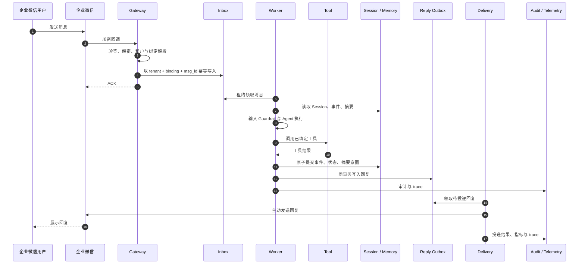

# 核心时序图

以下以企业微信消息为例，展示从回调到回复的可靠链路。`trace_id` 在入口创建或继承，
贯穿审计、指标和 tracing。

```mermaid
sequenceDiagram
    autonumber
    participant U as 企业微信用户
    participant IM as 企业微信
    participant G as Gateway
    participant I as Inbox
    participant W as Worker
    participant T as Tool
    participant S as Session / Memory
    participant O as Reply Outbox
    participant D as Delivery
    participant A as Audit / Telemetry

    U->>IM: 发送消息
    IM->>G: 加密回调
    G->>G: 验签、解密、租户与绑定解析
    G->>I: 以 tenant + binding + msg_id 幂等写入
    G-->>IM: ACK
    W->>I: 租约领取消息
    W->>S: 读取 Session、事件、摘要
    W->>W: 输入 Guardrail 与 Agent 执行
    W->>T: 调用已绑定工具
    T-->>W: 工具结果
    W->>S: 原子提交事件、状态、摘要意图
    W->>O: 同事务写入回复
    W->>A: 审计与 trace
    D->>O: 领取待投递回复
    D->>IM: 主动发送回复
    IM-->>U: 展示回复
    D->>A: 投递结果、指标与 trace
```

同一平台消息标识重投时，Inbox 唯一键阻止重复执行。若 Worker 在提交前退出，租约到期后
其他 Worker 可以重新领取；若副作用工具的结果不确定，会话进入阻塞状态，等待人工确认后
再继续处理。
