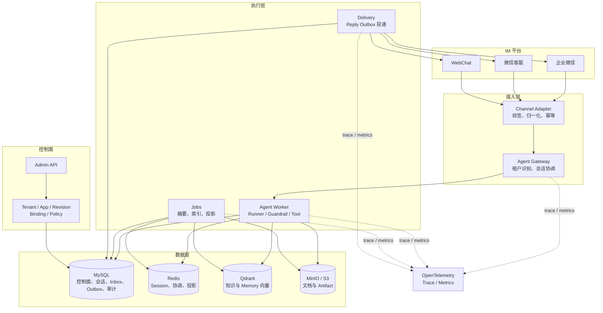

# 系统架构图

```mermaid
flowchart TB
    subgraph IM["IM 平台"]
        WC["企业微信"]
        KF["微信客服"]
        WEB["WebChat"]
    end

    subgraph GW["接入层"]
        ADAPTER["Channel Adapter\n验签、归一化、幂等"]
        GATEWAY["Agent Gateway\n租户识别、会话协调"]
        ADAPTER --> GATEWAY
    end

    subgraph EXEC["执行层"]
        WORKER["Agent Worker\nRunner / Guardrail / Tool"]
        JOBS["Jobs\n摘要、索引、投影"]
        DELIVERY["Delivery\nReply Outbox 投递"]
    end

    subgraph CONTROL["控制面"]
        ADMIN["Admin API"]
        CP["Tenant / App / Revision\nBinding / Policy"]
        ADMIN --> CP
    end

    subgraph STORE["数据层"]
        MYSQL[("MySQL\n控制面、会话、Inbox、Outbox、审计")]
        REDIS[("Redis\nSession、协调、投影")]
        QDRANT[("Qdrant\n知识与 Memory 向量")]
        MINIO[("MinIO / S3\n文档与 Artifact")]
    end

    OTEL["OpenTelemetry\nTrace / Metrics"]

    WC & KF & WEB --> ADAPTER
    GATEWAY --> WORKER
    WORKER --> MYSQL & REDIS & QDRANT & MINIO
    JOBS --> MYSQL & REDIS & QDRANT & MINIO
    DELIVERY --> MYSQL
    DELIVERY --> WC & KF & WEB
    CP --> MYSQL
    GATEWAY & WORKER & JOBS & DELIVERY -. "trace / metrics" .-> OTEL
```

可靠模式将 Gateway、Worker、Delivery 和 Jobs 作为独立角色运行。MySQL 是可靠消息链路
的事实源，Redis 用于协调和可丢失的投影；投影丢失后可由 MySQL 重建。
