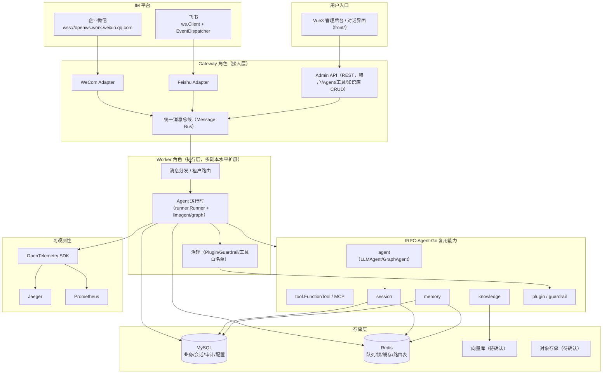
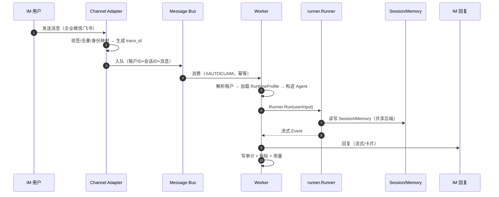

# 平台架构设计草案

> 阶段：0（准备与审阅）　｜　状态：草案（待用户确认后细化并转正至 `docs/`）

## 一、总体架构

### 1.1 架构图（Mermaid）



### 1.2 角色与组件职责

| 组件 | 职责 | 复用/新增 |
| --- | --- | --- |
| **Gateway** | 对外接入：Admin API + IM WSS 适配器；租户解析、鉴权、消息入队 | 平台层新增（复用 `server/*` 与 `openclaw` 思想） |
| **Worker** | 消费消息、构造租户 Agent、调用 `runner.Runner` 执行、回流回复 | 平台层新增（复用 `runner`） |
| **Admin** | 租户/Agent/工具/知识库/IM 配置的 CRUD 与版本发布 | 平台层新增 |
| **Channel Adapter** | 企业微信/飞书 WSS 连接、消息解析、回复 | 平台层新增（`IMAdapter` 接口） |
| **Storage Adapter** | 后端抽象层，租户级选择与路由（MySQL/Redis） | 平台层新增 |
| **Telemetry** | OTel 埋点 → Jaeger + Prometheus | 复用 tRPC-Agent-Go Telemetry |

### 1.3 部署形态（初步）

- **单一二进制 + 角色标志**（`--role=gateway|worker|admin|all`），便于本地/Compose 快速跑与 K8s 分角色部署。
- K8s：Gateway 与 Worker 各自 Deployment，通过 Redis Streams 解耦，HPA 按队列积压/CPU 伸缩。

---

## 二、模块划分

```text
agent-platform/
├── cmd/trpc-service/        # 入口（角色解析、启动装配）
├── internal/                # 平台层（注释英文）
│   ├── gateway/             # Admin API + 接入
│   ├── worker/              # 消费与执行
│   ├── tenant/              # 租户模型、隔离上下文
│   ├── agentmgr/            # Agent 运行时管理、版本发布/回滚
│   ├── channel/             # IMAdapter 接口 + wecom/feishu 实现
│   ├── bus/                 # 统一消息总线（Redis Streams）
│   ├── storage/             # 后端抽象层（mysql/redis）
│   ├── toolreg/             # 工具注册与权限（FunctionTool 封装）
│   ├── knowledge/           # 知识库接入
│   ├── audit/               # 审计日志
│   ├── metric/              # Prometheus 指标 + OTel
│   └── secret/              # 密钥管理与脱敏
├── front/                   # Vue3 前端
├── deployments/             # K8s 清单 + Dockerfile
├── docs/                    # 正式文档（中文）
└── tempdocs/                # 中间文档（中文）
```

> 目录以 ponytail 原则（简洁、职责分明、可扩展）为准，将在每个编码阶段后审查调整，不在本阶段固化。

---

## 三、数据流与控制流

### 3.1 一条 IM 消息的完整链路（控制流 + 数据流）



---

## 四、租户模型

```text
Tenant（第一隔离边界）
 ├─ tenant_id（全局唯一，贯穿所有层）
 ├─ 应用/模型配置（model provider、base URL、模型名）
 ├─ 工具权限（工具白名单 + RBAC）
 ├─ IM 通道绑定（企业微信/飞书账号 + 验签密钥）
 ├─ 数据后端配置（MySQL/Redis 命名空间）
 ├─ 知识库绑定（可选）
 └─ 审计策略（记录粒度、保留期、脱敏规则）
```

**隔离机制**：
1. **配置隔离**：租户配置独立存储，运行时按 `tenant_id` 加载，互不可见。
2. **数据隔离**：所有表带 `tenant_id` 列 + 查询强制过滤；Redis key 前缀 `{tenant}:`；Session/Memory 用租户级命名空间。
3. **工具权限隔离**：租户级工具白名单，模型只能调用已授权工具。
4. **日志脱敏与密钥管理**：密钥经 KMS/Secret 注入，日志统一脱敏（Secret Masking），trace 不落敏感信息。
5. **上下文传递**：Go `context.Context` 注入 `tenant_id`，从 Gateway 到 Worker 到 Runner 全程透传。

---

## 五、会话路由策略

- **无状态 Worker + 共享 Session/Memory 后端**：Worker 不持有会话本地状态，任意节点都能处理任意会话。
- **会话定位**：`session_id` 由「租户 + IM 通道 + 用户 + 会话对象」确定性生成（群聊/单聊规则见阶段 5）。
- **路由表**：Redis 记录 `session_id → tenant_id → agent_id` 映射，用于快速定位；MySQL 持久化权威映射。
- **粘性（sticky）判定**：**不需要** sticky session，依赖 `session/redis` 或 `session/mysql` 共享后端实现无状态水平扩展；一致性哈希仅用于「同一会话的并发消息串行化」锁（Redis 分布式锁按 session 粒度）。

---

## 六、数据同步方案

| 场景 | 方案 | 理由 |
| --- | --- | --- |
| 多节点并发写同一 session | Redis 分布式锁（按 session_id）+ MySQL 行级事务 | 避免并发覆盖，保证 event 顺序 |
| Session event/state/summary 更新顺序 | 事件序列号（单调递增）+ 写后读校验 | 保证有序、可恢复 |
| Memory 跨节点可见性 | 写入 Redis（原子 Lua）+ 异步落 MySQL，读走 Redis | Redis 作为共享缓存，天然跨节点 |
| 后端迁移（Redis→MySQL） | 双写过渡 + 数据回填脚本 + 灰度切换 | 平滑迁移，可回滚 |
| IM 消息重复投递 | 消息 ID 幂等表（Redis SETNX / MySQL 唯一键） | 去重，保证 exactly-once 语义 |

**一致性取舍**：MySQL 提供强一致（事务）；Redis 提供最终一致（高性能缓存）；跨节点共享状态以 MySQL 为权威，Redis 加速。

---

## 七、IM 适配层

```go
// IMAdapter 统一接口（注释英文，仅示意）
type IMAdapter interface {
    Start(ctx context.Context) error
    Stop(ctx context.Context) error
    Receive() <-chan *InboundMessage   // 统一消息总线入口
    Send(ctx context.Context, msg *OutboundMessage) error
    Name() string
}
```

- **企业微信**：Adapter 使用 `wss://openws.work.weixin.qq.com`，Go 实现（借鉴 aibot-node-sdk 协议，复用 tRPC-Agent-Go IM 通道能力）；回调验签、消息去重、身份映射。
- **飞书**：官方 v3.7.2 `ws.Client` + `EventDispatcher`，订阅 `im.message.receive_v1`。
- **统一消息总线**：两个适配器都向总线投递标准化消息，支持消息路由、会话关联、回复。
- **群聊/单聊**：`session_id` 生成规则区分（群：`tenant:channel:group:chatId`；单聊：`tenant:channel:user:openId`），跨群/跨租户严格隔离。

---

## 八、后端抽象层

```go
// Storage/Session 后端抽象（示意）
type SessionStore interface {
    Get(ctx context.Context, tenantID, sessionID string) (*Session, error)
    Append(ctx context.Context, tenantID, sessionID string, ev *Event) error
    // ...
}
```

- 统一数据访问抽象：Session、Memory、Summary、Artifact、Knowledge、Audit 各自接口 + 后端实现。
- 租户级后端选择：租户配置指定后端，Storage Adapter 按 `tenant_id` 路由到对应实现。
- 至少支持 MySQL、Redis（其余后端经确认后扩展）。

---

## 九、可观测性

- **追踪**：OpenTelemetry SDK + Jaeger exporter；trace 贯穿 Channel → Dispatch → Worker → Runner → Governance → Tool → Session → Reply。
- **指标**：Prometheus 暴露业务指标（会话数、消息数、模型/tool 延迟、IM 投递成功率、错误率、token 消耗、每租户成本）。
- **审计日志**：关键操作落 MySQL（存储选型待确认），字段含 `tenant_id/channel/user_id/session_id/agent_name/tool_name/decision/latency/error_type/cost/trace_id`。

---

## 十、K8s 部署拓扑

- **Deployment**：gateway、worker（多副本）、（可选 sandbox）。
- **Service**：gateway ClusterIP + Ingress；worker 无对外入口。
- **HPA**：worker 按 Redis Streams 积压 + CPU 伸缩。
- **ConfigMap/Secret**：配置与密钥分离（模型 key、IM token、DB 密码走 Secret）。
- **健康检查**：liveness/readiness 探针；滚动更新策略。
- **可观测性 sidecar/外部**：Jaeger + Prometheus（阶段 10 细化）。

---

## 十一、本阶段待澄清的关键分歧

1. **交付形态**：README 要求「架构设计为主」，任务 Prompt 要求「11 阶段完整实现」——二者需对齐。
2. **后端边界**：任务强制 MySQL+Redis；参考 PR 用 PostgreSQL+Qdrant+MinIO——向量库/对象存储/消息总线需确认。
3. **Workspace 层级**：是否需要 Tenant→Workspace→Agent 三级，还是 Tenant→Agent 两级。
4. **沙箱/审批/Skill**：是否纳入范围及深度。
5. **LLM Provider**、前端 E2E 工具、API 形态（REST vs gRPC-Web）等工程细节。
